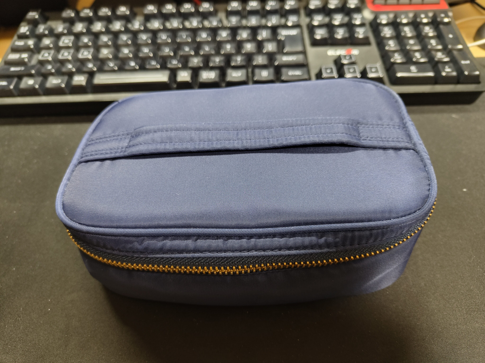

## はじめに

最近、Anker 347 Power Bankという40000mAhのクソデカいモバイルバッテリーを買ったんですが、ちょっとサイズや質感的にケースがほしい感じなんですよね。

しかしAmazonでケースを検索すると2,500円くらいのものしかなく、他で代用できないかと考え家中を探し回った結果、とても丁度いいものを見つけたのでこれを紹介していきます。

## 買ったモバイルバッテリーについて

Anker 347 Power Bankと調べてもらえればわかるものではありますが、どんなサイズ感かだけは見てもらいましょうか。

はい、でかいですね。40000mAhあるので当然ですが。

以前使っていたAnker PowerHouse 100と比較するとこんな感じ。

27000mAhのAC100V対応バッテリーもなかなかのサイズでしたが、4000mAhともなると厚みが違いますね厚みが。

まあこんな感じでデカくて重いわけですよ。

これをこのままかばんに入れてしまうとどんどん擦れて下に落ちていってしまうわけです。

ケース…欲しいですよね。

## ケース探しの旅

というわけで良い感じに使えそうなケースを探します。

まずは以前使っていたAnker Power House 100付属の巾着から

うーんこれはちょっとサイズが合いませんね…

そしてなんやかんやあって家中を漁ってると母から



なんかそういうサイズの入れ物あった気するから探してくるわ〜



との知らせが。

その後しばらくして持ってきたのがこれ。

丁度いいサイズの予感…！

## 資生堂の化粧ポーチ

母が持ってきてくれたこの化粧ポーチ、入れ物としてどれくらい使えるのでしょうか。

とりあえずモバイルバッテリー本体を入れてみましょう…

シンデレラフィット！！！！！！

なにこれすごい。もはや専用ケース…

そういえばケースに小物も入るなと思ったので入れてみると…

もはやAnker純正だろこれ。

でもタグは…

資生堂！

## 気になったこと



すっごく質感のいいケースだけどこれどうしたん？

高いやつだとしたらこんな使い方もったいないし…





化粧ポーチなんて安物しか買った覚えがないからこれはたぶん当時の行きつけの化粧品店で貰ったやつだね。

その証拠に化粧品店で貰った試供品が大量にここに入ってたよ。(全て期限切れ)



## おわりに

20年以上試供品の化粧品が入った状態で使われていなかったせいで強すぎるくらい化粧品の匂いがする状態でしたが、無事に丁度いいケースを入手することができました。

ガジェットケースには化粧品ポーチが意外と優秀。これは今後活きてきそうなので覚えておこうと思います。

今回の記事、吹き出しを使いたいがために書いたのでちょっと微妙な感じだったかも。

それでは、また次回。
