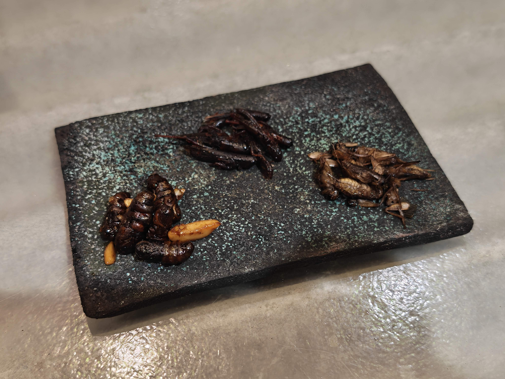
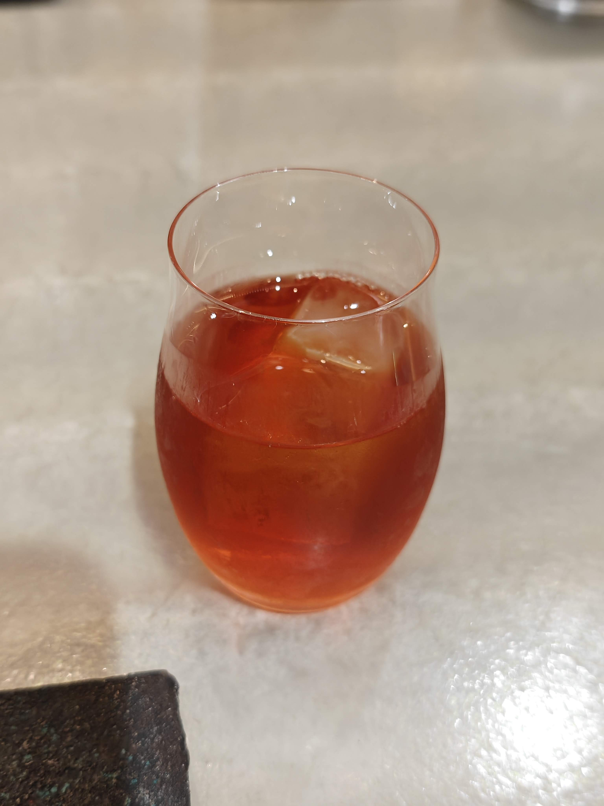

## はじめに

皆さんは昆虫食についてどのようなイメージを持っていますか？

多くの方が「食糧難対策」や、「ゲテモノ枠」というイメージを持っていることかと思います。  
私もそうでした。

今回はそんなイメージを覆すほどのおいしい昆虫食料理が食べられるお店、ANTCICADAに行ってきたのでそのお話です。

## ANTCICADAとは

一言で言えば、コオロギラーメンをメインとした、昆虫などの生き物の料理が食べられるお店です。

HP：[https://antcicada.com/](https://antcicada.com/)

地球少年 篠原さんが美味しい料理を作り、楽しそうに虫やその糞を見せてくれます。

東京の馬喰町のあたり、秋葉原や岩本町、浅草橋駅などから徒歩で行ける距離にあります。

今回私は地下鉄日比谷線の秋葉原駅から徒歩で向かいましたが、10分もかからずに着きました。

<iframe src="https://www.google.com/maps/embed?pb=!1m18!1m12!1m3!1d3240.22771859564!2d139.7793327753492!3d35.696013472582365!2m3!1f0!2f0!3f0!3m2!1i1024!2i768!4f13.1!3m3!1m2!1s0x60188f3f84a9538d%3A0xc2c90f72618fac8c!2zQU5UQ0lDQURB77yI44Ki44Oz44OI44K344Kr44OA77yJ!5e0!3m2!1sja!2sjp!4v1762093142830!5m2!1sja!2sjp" width="600" height="450" style="border:0; position: absolute; top: 0; left: 0; width: 100%; height: 100%;" allowfullscreen="" loading="lazy" referrerpolicy="no-referrer-when-downgrade"></iframe>

## 頂いた料理

初めての昆虫料理ということで、いろいろ味わってみようと、3つ注文してみました。

### コオロギラーメン

ANTCICADAといったらこの料理、コオロギが180匹使われたラーメンです。

スープは醤油や香味油、出汁も全部コオロギから作られており、麺にももちろんコオロギが。

仕上げに店内で育てているコオロギの素揚げが乗っている、文字通りコオロギ尽くしです。

味はスープの旨味が強い美味しい醤油ラーメンといった感じで、昆虫っぽさは全く感じませんでした。

素揚げのコオロギも調理の日に合わせて餌の量や種類を調整しているとのことで、生き物を丸ごと食べる際のえぐみなども一切感じませんでした。

昆虫と甲殻類は近い種類と言われますが、コオロギの素揚げはかき揚げのエビと同じような気持ちで食べられる感じです。

今回食べたコオロギラーメンの出汁の比率は、コオロギ9割昆布1割とのことで、ほぼコオロギで構成されているものでした。

実際のだしがらを見せていただきましたが、マジでほぼコオロギで、ちょっとだけ昆布が入ってるレベルでした。

また、出汁を取る前のコオロギも見せていただき、2種類のコオロギをコンディションに合わせてブレンドしていることなどを聞きました。

コオロギはタンパク質豊富で、出汁を取ると旨味の強い良い出汁が出るとのこと。

更に、コオロギは雑食な関係上、食べるものによって味が変化するらしく、どのような味に育て上げるかも楽しみの一つなのだそう。

長々と語りましたが、簡単にまとめると想像以上に普通に美味しい醤油ラーメンです。

昆虫という固定観念を捨てて一度食べてみてほしいなと思います。

### 佃煮3種盛り

昆虫料理の定番といえば佃煮ではないでしょうか。

イナゴや蜂の子などを甘辛く煮詰めた料理は古くから昆虫を食べる方法として知られています。

今回はそんな料理をANTCICADAではどう仕上げるかを見たく、3種盛りで注文してみました。

左からカイコ、イナゴ、コオロギです。

イナゴの佃煮は言う事ありませんね。よく食べられているように普通に美味しいです。

コオロギの佃煮は昆虫らしく、羽や足が少し気になる感じでした。

骨まで食べる小魚や甲殻類の素揚げなどに似た感じで、身を食べるというよりも殻などを含めた全身を味わうような感じです。

カイコの佃煮は他の2種とは違い、身をしっかりと味わえるものでした。

セミなど、昆虫の一部にはナッツに似た風味を感じるものがあるらしいですが、相性が良いのかカイコの佃煮にはナッツが入っていました。

個人的には身を食べるならカイコ、安定を求めるならイナゴ、昆虫っぽさを感じるならコオロギが良いかなと思います。

### 桜毛虫の糞のお茶

今回頼んだ中で一番不安だったのがこちら、桜毛虫の糞のお茶です。

毛虫の糞のお茶ですよ。虫のウンコ汁です。

それを人間が飲むなんて…

と、飲む前は思っていましたが、飲んでみて印象は大きく変わりました。

こちらのお茶は、桜の葉しか食べない種類の毛虫の糞を使用しているとのことで、お茶からは桜の葉の香り（桜餅のあの匂い）を強く感じました。

飲んだ味としては、紅茶のような発酵した葉のお茶のような風味を感じました。

篠原さん曰く、この味は桜の葉単体ではなく糞からでないと出せないものだそうです。

紅茶のような風味に関しては、消化の過程で発酵されているためだそう。

毛虫の糞という情報が無ければ、桜が強く香る紅茶だと思って何の疑いもなく飲むでしょうね。

## おわりに

ずっと行ってみたいと思っていたお店なので行けて良かったです。

今回、食後にお茶を味わいながら篠原さんとお話していたらなんと、カイコの糞のお茶をサービスしていただきました。

カイコはクワの葉しか食べないため、桜とはまた違ったクワの香りが強いお茶でした。

味はこちらも紅茶や烏龍茶に近い、発酵した葉のお茶の味で美味しかったです。

ちょっとお値段高めのため頻繁には通えないですが、必ずまた来て味わいたいと感じたものばかりで良いお店でした。

皆さんもよかったら挑戦してみてください。

それでは、また次回。
