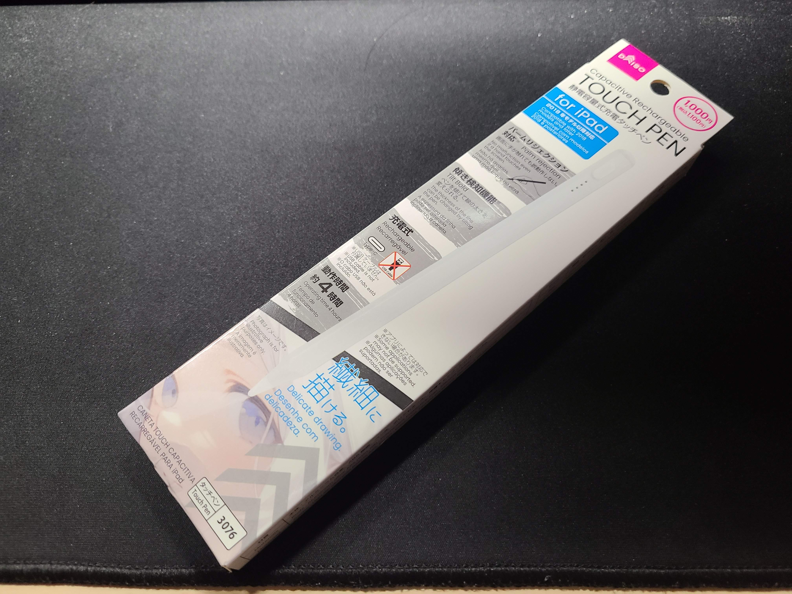
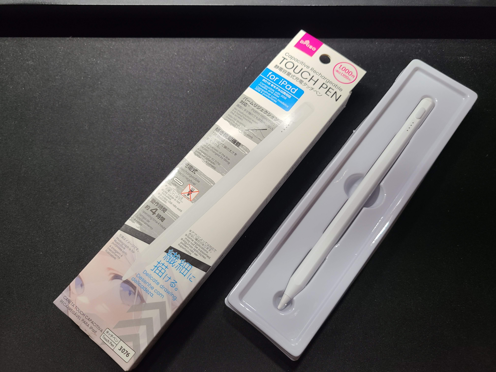
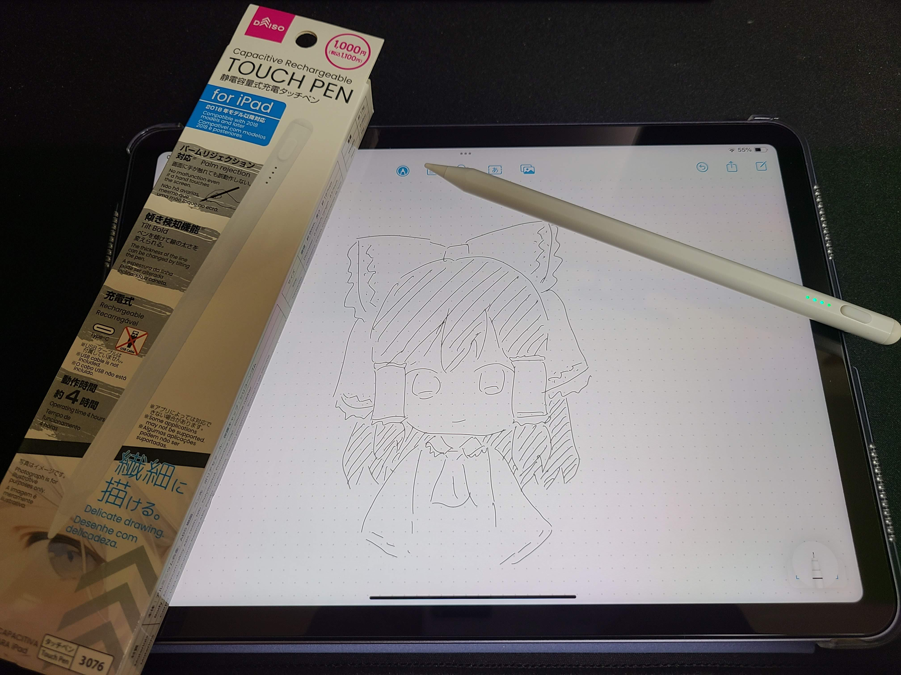

## はじめに

「そこに無ければ無いですね」でおなじみの100円ショップのDAISOからは度々競合をコスパで破壊するような製品が発売されたりしますが、今回購入したApple Pencil互換ペンも相当な実力なので紹介したいと思います。

## 買ったもの

今回購入したのはこちらの「静電容量式充電タッチペン for iPad」です。

開封すると中身はこんな感じ。

写真に写っているものの他には簡単な説明書があるくらいで、充電ケーブルなどはありませんでした。

本体には充電端子保護のためにキャップが付いていますが、iPadにくっつけたときに浮いて取れやすくなるので外しておいたほうが使いやすいですね。



    

    

    



## 純正Apple Pencilとの比較

定価21,800円の純正Apple Pencil(第2世代)と比較していきます。

見た目の差はこんな感じ。



    

    



サイズ感や磁石でくっつく面の感じはだいたい同じでした。

重量は全く違い、純正はずっしり思いのに対して、互換ペンはプラスチックのような軽さで、搭載している機能の差なのかそこには大きな差がありました。

DAISOの互換ペンは他社から出ている2〜3,000円クラスの互換ペンと基本的に同じ機能で、書き心地も純正ほどの良さはないですが悪くありませんでした。

ペンを試しに買ってみる目的やサブ、予備のペンに最適ですね。

## 使ってみた

適当にペンに対応したアプリを使って試しがきをしてみました。

フリーボードで絵を描くもんじゃないですね。

真剣にイラストを描く場合は筆圧対応の純正ペンが必要なことも多いですが、傾き検知のみで問題ない人はこのペンでも十分やっていけると思います。

## おわりに

今回はDAISOのペンが気になったので購入してみた話でした。

iPadを持っていてスタイラスペンを持っていない人に渡して気に入ったらプレゼントする企画をやってもいいくらい安価で質も高い製品で驚きました。

iPad利用者の方は一度試しにお近くのDAISOで購入してみてはいかがでしょうか。

それでは、また次回。
