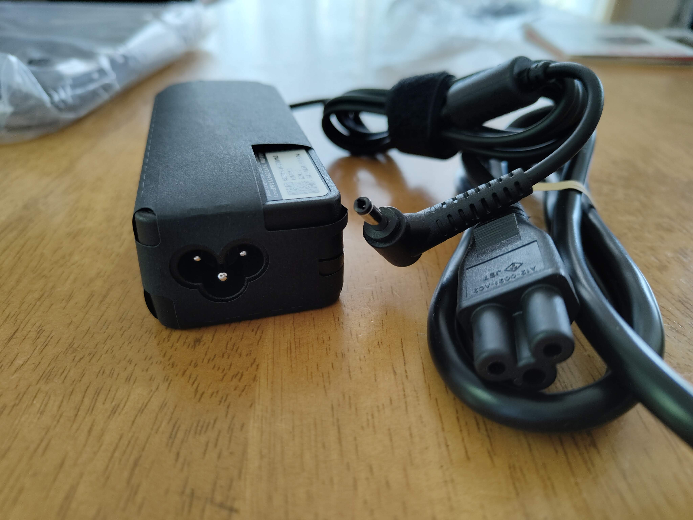
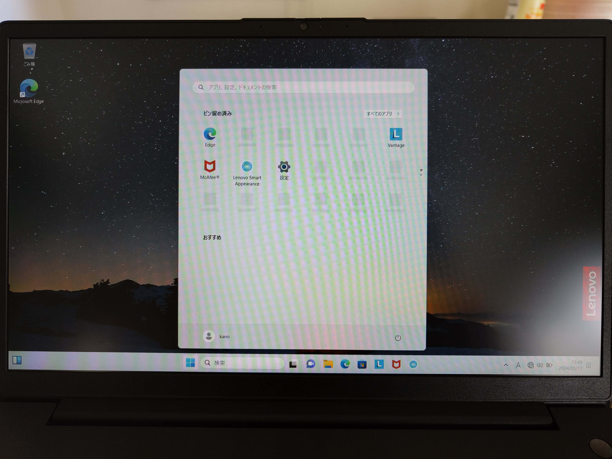

## はじめに

(普通の)Windows10のサポートも残り1年半ほどとなり、現在使っているPCの進退を考える時期になりました。

メモリ増設やストレージ換装で使うのか、それとも買い替えるのか…

考えた末に今回は祖母のPCを買い替えることにしたのでその話です。

## プレゼントしたPC

今回購入したPCはLenovo V15 Gen4の価格comモデルです。

Ryzen5/16GB/512GBというスペックで6.6万円でした。

細かいスペックは比較のときに紹介するとして、ここではこのPCの外観などを紹介します。

まずは箱から出して本体を舐め回しながら見るところまで。



    

    

    

    

    

    



いたって普通のシンプルなノートPCって感じですね。

外装がプラスチックのため、アルミなどのPCに比べると安っぽさがありますが、今まで使ってきた2014年くらいのノートPCに比べればありですね。

ポート類が少なめなのが~~PCオタクとして~~気になるポイントですが、今回の利用者は私の祖母です。充電器と外付けDVDドライブ、無線マウスのレシーバー以外使わないので全く問題なしですね。

次に本体を開けたところも見ていきます。



    

    

    

    

    

    



まあ普通って感じですね。

キー配列も特に変なところもなく、輸送時に必要な保護もされている。

カメラカバーがあるのは嬉しいポイントですね。

充電器はこんな感じ。

ACアダプタ側は~~ミッ◯ー~~3ピンタイプ、PC側は丸型ですね。

Lenovoは角形コネクタやめたんですかね。あれ挿したとき安定して好きだったのに。

OSはWindows 11 Homeでした。

## 今までのPCとの比較

今まで使ってたノートPCと今回購入したノートPCの比較です。

旧PCはソリティアが正常に動かないくらい重かったです。

| 項目 | 旧PC | 新PC |
| --- | --- | --- |
| 機種名 | Lenovo B50-70 | Lenovo V15 Gen4 |
| CPU | Core i3 4030U | Ryzen 5 7430U |
| RAM | DDR3 4GB | DDR4 16GB |
| ストレージ | SATA HDD 320GB | NVMe SSD 512GB |
| 画面 | 15.6型 TFT 1366x768 | 15.6型 IPS 1920x1080 |
| 0S | Windows 10 Home | Windows 11 Home |

新しくなってある程度の3Dゲームくらいなら動いてしまいそうな感じになりましたね。

これでソリティアも快適に遊べると思います。

見たい人のためにタスクマネージャと設定画面のスクショを置いておきますね。



    

    

    

    

    

    



## ベンチマーク

新しいPCがあったらベンチマークを取りたいというもの。

というわけで早速結果です。



    

    

    

    



いいですね。とても。

## おわりに

あらゆる動作が快適になり、なによりソリティアが問題なく遊べるPCになったので祖母も喜んでいました。

今回購入したPCは注文時にカスタマイズが可能で、無線モジュールを11axのものから11acのものにダウングレードすることができます。

今回は11axがあっても意味がない環境で使用するPCだったのでダウングレードして少し安く購入することができました。

最近画像を入れすぎてそろそろGitHubに怒られないか怖くなってきました。

近い内に履歴の整理などをしてリポジトリを軽量化したいですね。

それでは、また次回。
