
この記事は広告(PR)を含んでいます。


## はじめに

PDFを編集する、または作成する際、どのようなソフトウェアを使用していますか？

私は今まで作成はGoogle DocsやInkscapeなどから出力し、編集は上から図形と文字を貼り付ける上書きで対応していました。

これで見た目は問題ないのですが、文字の選択が狂ったり、少し位置がズレたり、容量が増えたりと満足はしていませんでした。

今回は[PDF編集ソフト](https://pdf.minitool.com/)のMiniTool PDF Editor 無料版 (V2.0)を使ってみて、他形式からの変換による作成や上書きによる編集との違いを見ていこうと思います。

## MiniTool PDF Editorとは

MiniTool PDF Editorはバックアップソフトやパーティション切り分けソフトなどが有名なMiniToolが開発したPDF編集ソフトです。

このソフトの特徴は、画像を編集するように直感的にPDFが編集できるところで、無料版のトライアル期間は編集や変換などのフル機能が試せます。

Windows版しかありませんが、macOS版やLinux版を用意している方が珍しいですからね。

デフォルトでは英語のソフトですが、設定で日本語にすることもできます。

この記事で使用しているバージョンは以下のとおりです。

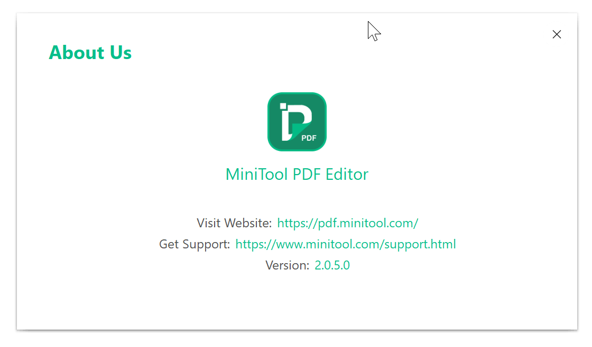

## ダウンロード、インストール方法

こちらのサイトからダウンロードすることができます。

[https://pdf.minitool.com/](https://pdf.minitool.com/)

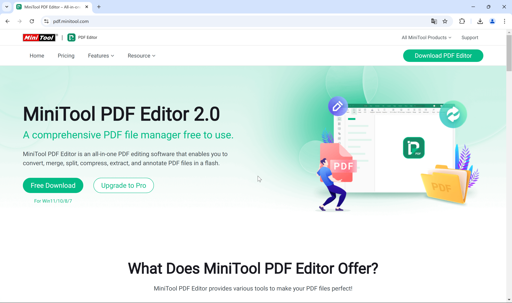

ダウンロードの際に他ページに遷移したり、有料プランに誘導したりしてこないあたりユーザーに親切で好印象です。

インストーラーを立ち上げると管理者権限の要求後、シンプルな画面が表示され、簡単にインストールできます。

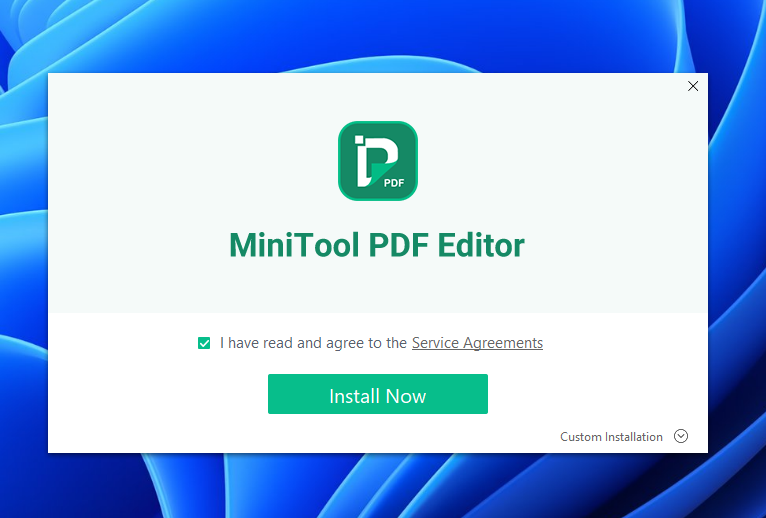

MacBook Pro上の仮想マシンを使用しているためかインストーラーの画面が小さく出てしまいました。高解像度ディスプレイを使用している場合は注意が必要かもしれませんね。

インストールが完了するとこのような画面が表示されます。

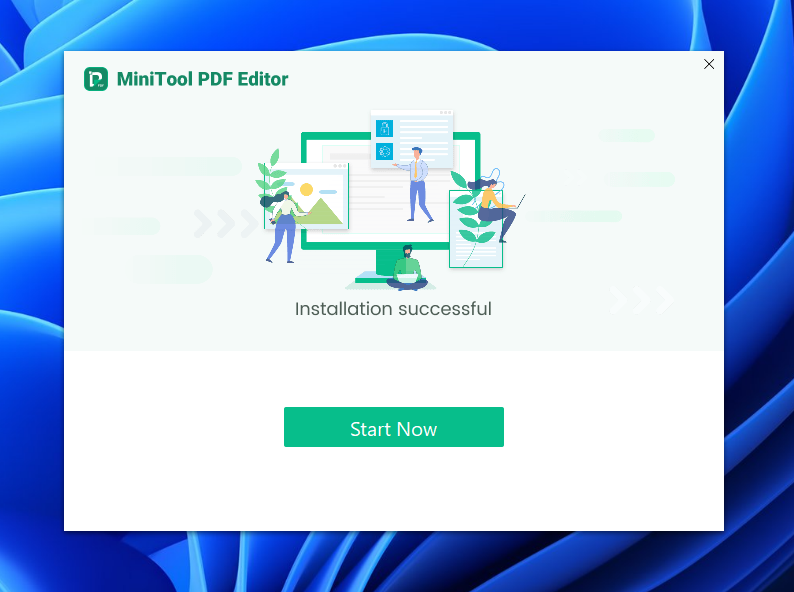

ここもシンプルでいいですね。

`Start Now`をクリックするとインストーラーが閉じられ、MiniTool PDF Editorが起動します。

初回起動時にこのような画面が表示されますが、無料試用版の期限が表示されているだけなので閉じてしまって大丈夫です。

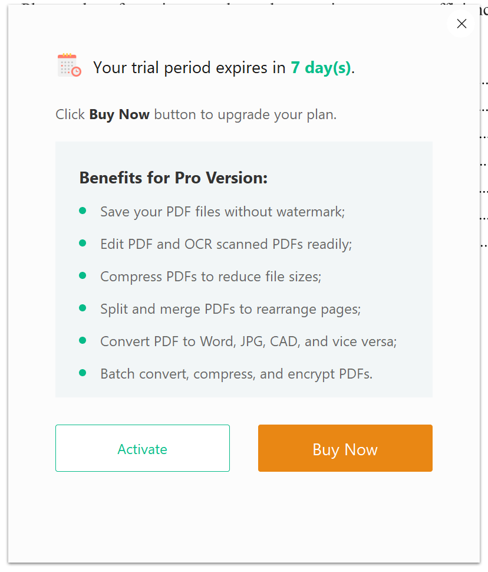

このタイミングではじめて有料版への案内が出ました。ちょうどいいくらいでしたね。

## 既存のPDFを編集してみる

今回編集する対象として、[前回の記事](https://sunset0916.net/blog/2024/12/31/the-sanzai-2024/)のビルド前のMarkdownからVSCodeの拡張機能で作成したPDFファイルを使用します。

見出しと本文、画像があり、複数ページある文章です。

### テキスト

まずは王道のテキスト編集からやっていきましょう。

`編集`タブから`テキストを編集`を選択することで、Wordなどのテキストボックスのように編集ができます。

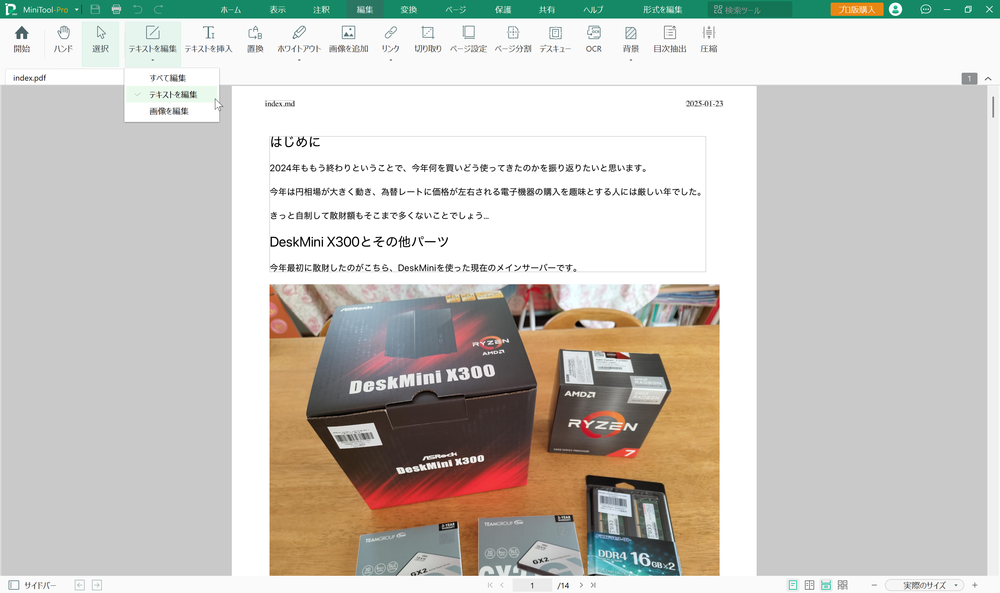

見出しを編集して下線を付けてみました。

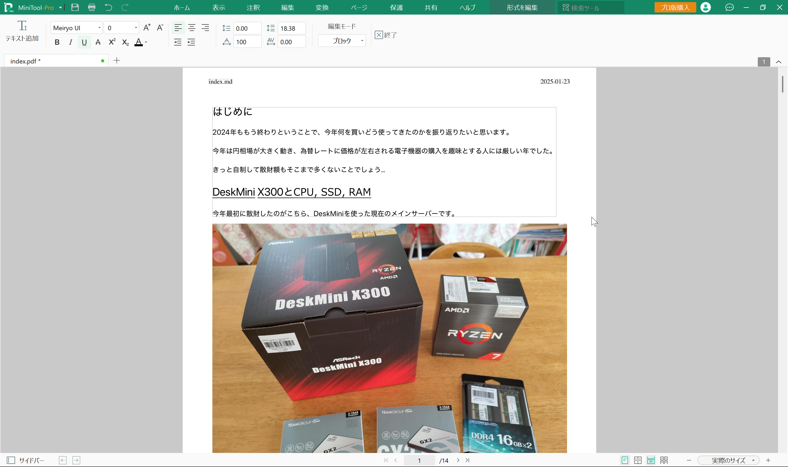

しっかりともとのPDFの文字を編集できていますね。

使い慣れたソフトウェアとほぼ同じ感覚でPDFが編集できるので迷わなくていいですね。

### 画像

こちらも王道の編集、画像の編集をしてみます。

`編集`タブの`画像を編集`を選択し、画像の編集ができる状態にします。

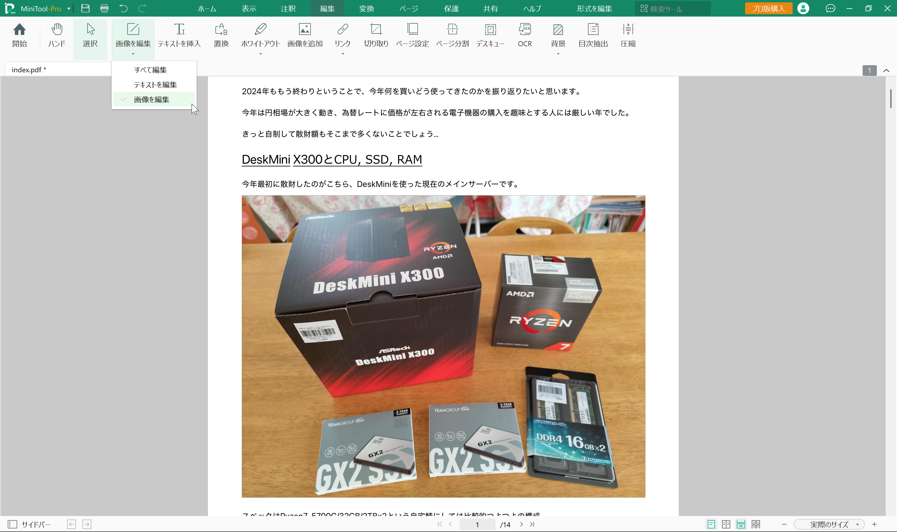

編集したい画像を選択すると、Wordなどと同じように回転やサイズ変更、差し替えなどができます。

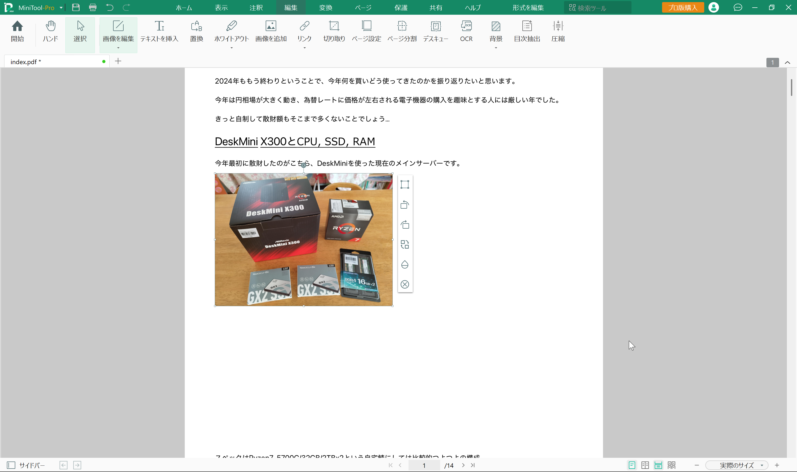

`画像を追加`を選択すると、画像ファイルをPDF上に追加することができます。

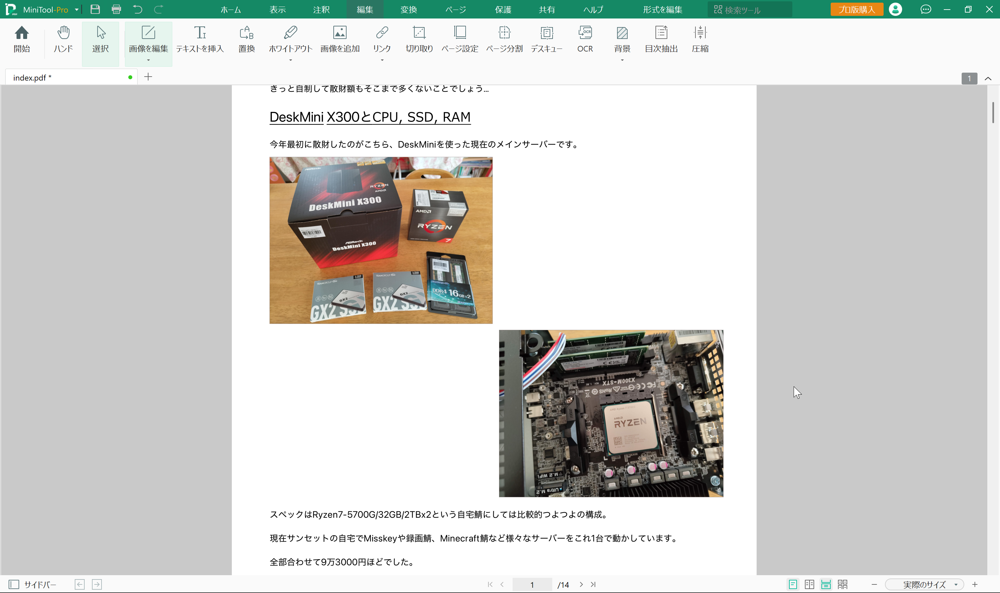

### ページ

PDFを編集するうえで意外と使うページの編集。このソフトでは、追加や削除、並び替えなどができます。

`ページ`タブを選択するとページ編集画面になります。

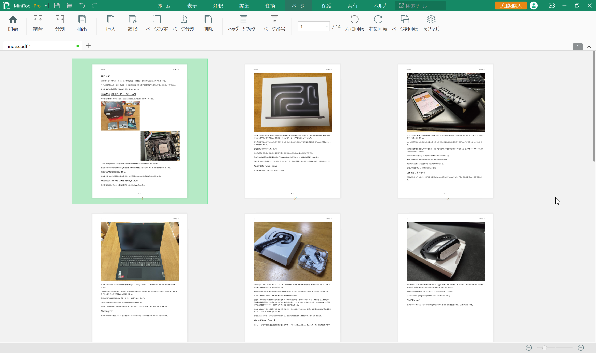

この画面で順番を入れ替えたり、追加や削除を行うことでページ編集を行うことができます。

試しに先頭を入れ替えて、3ページ目を削除してみました。

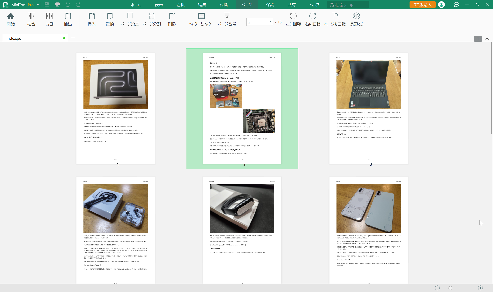

## PDFを新規作成してみる

PDFを専用ソフトでゼロから作ってみる。個人的にはあまりすることがない行為ですが、どれくらい簡単にできるかを見ていきます。

PDFの新規作成は左上のメニューからすることができます。

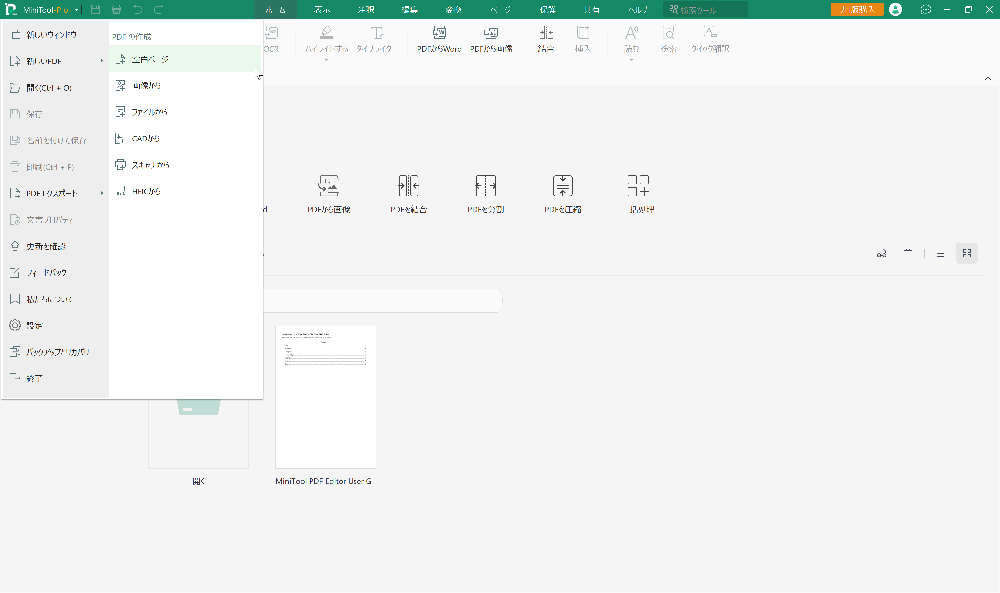

空白のページの他に、WordやExcelなどのファイルや画像などからPDFファイルを作成することができます。

今回は空白のページから作成してみます。

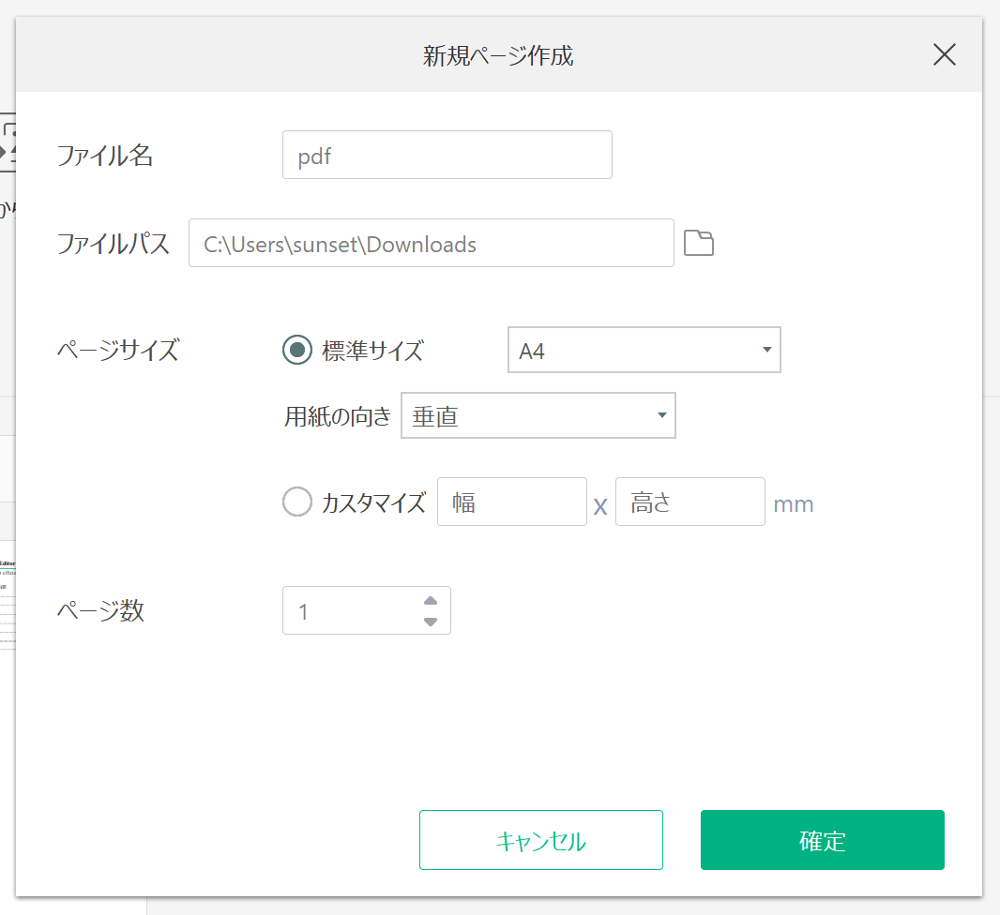

用紙の向きやサイズ、ページ数などが設定できます。

新規作成するとこんな感じ。とてもシンプルですね。

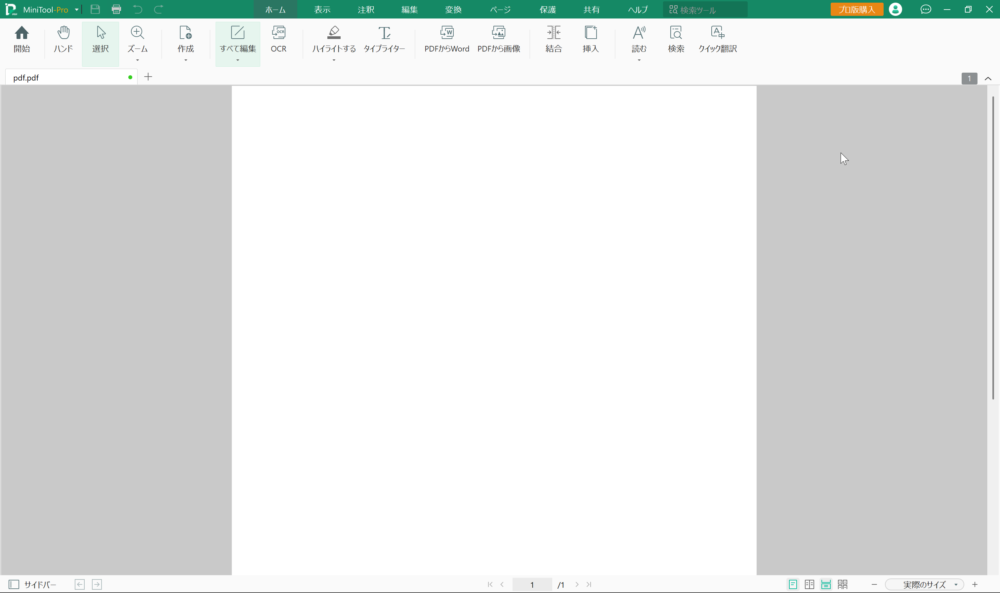

いろいろ自由に追加できて楽しいですね

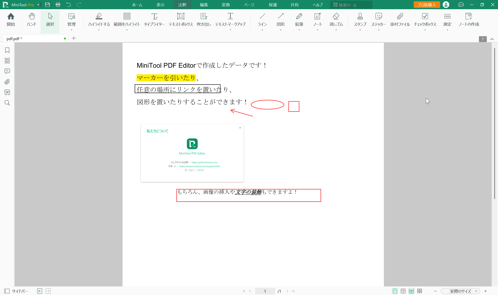

## 有償版の価格

こちらのサイトに記載があります。

[https://pdf.minitool.com/pricing/](https://pdf.minitool.com/pricing/)

通常であれば、1台までの月額19ドル, 2台までの年額99ドル, 1台までの永久ライセンス199ドルという料金体系みたいです。

私が確認したタイミング(2025年1月)では年額が69ドル, 永久が99ドルになるセールを実施しているみたいでした。

永久ライセンスでもPDF編集ソフトとしては手頃な価格でいいですね。

## おわりに

さてここまでMiniTool PDF Editor 無料版 (V2.0)を使ってきましたがいかがだったでしょうか。

実際に使ってみると想像以上に直感的で驚きました。

PDFの編集はめんどくさいという思い込みからWordのPDF出力を使用していましたが、これならPDFを直接作成、編集したいと思いました。

無料トライアルで7日間はフル機能が使えるのでこの機会に試してみてはいかがでしょうか。

それでは、また次回。
