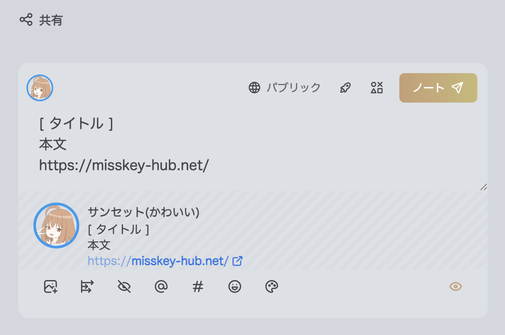
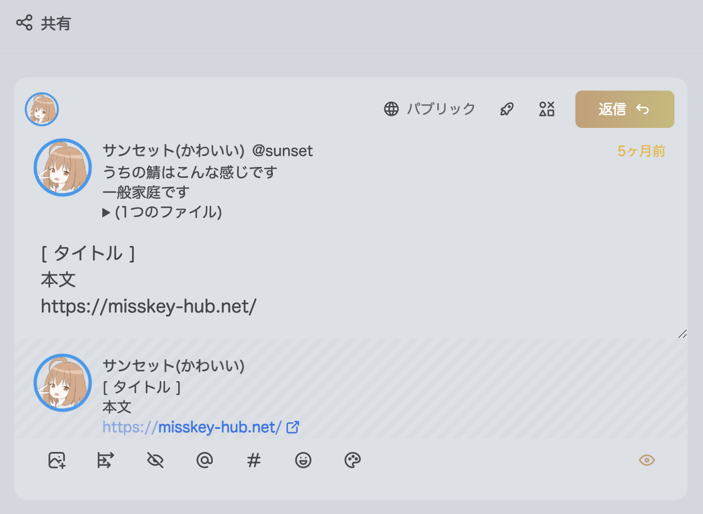
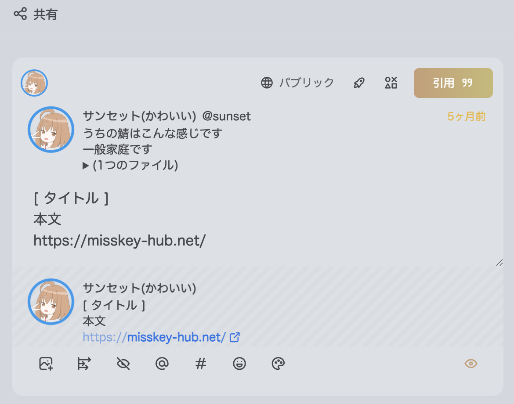
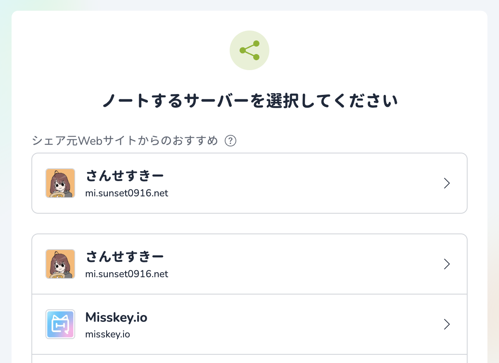


この記事は[Misskey Advent Calendar 2024](https://adventar.org/calendars/10208) 12日目の記事です。


## はじめに

はじめましての方ははじめまして、そうでない方はこんにちは。サンセット([@sunset@mi.sunset0916.net](https://mi.sunset0916.net/@sunset))です。

さんせすきーという小規模なMisskeyサーバーの管理者をやっている美少女 **[要出典]** です。  
そういえば最近2周年を迎えました。女装するとサーバーが安定するって話は本当だったんですね。

さて今回はMisskey Hubを経由するMisskeyへの共有リンクについてひとつずつ触っていこうと思います。

今回はMisskey Hubの以下のドキュメントを実際に触りながら確認していくことが主な内容です。

[共有フォーム | Misskey Hub](https://misskey-hub.net/ja/docs/for-users/features/share-form/)

内容はほぼこのままです。触りながら覚えることが目的なので内容には期待しないで（

## 基本の共有

これが使えるだけで基本の共有はできてしまいます。

Misskey Hubほんまにありがとう。

| 名前 | 説明 |
| --- | --- |
| `title` | 本文の先頭に挿入されるタイトル |
| `text` | 本文 |
| `url` | 本文の末尾に挿入されるURL |

```plaintext
https://misskey-hub.net/share/?title=タイトル&text=本文&url=https://misskey-hub.net
```


Misskeyで共有




## リプライ(返信)する

自分の投稿に返信がほしいときなどに使えるかも…？

| 名前 | 説明 |
| --- | --- |
| `replyUri` | リプライ先のURL |

```plaintext
https://misskey-hub.net/share/?title=タイトル&text=本文&url=https://misskey-hub.net&replyUri=https://mi.sunset0916.net/notes/9w2uw7v597
```


サンセットの投稿に返信


ちなみに該当ノート以外のサーバーからだとタイトルや本文などがうまく反映されません。どうして？



## Renote(引用)する

自分の投稿を引用してほしいときなどに。

ちなみに、引用画面で何も入力しないで投稿するとRenote扱いにすることができます。  
公開範囲を変えてRenoteするときなどに使われる手法ですね。

| 名前 | 説明 |
| --- | --- |
| `renoteUri` | リプライ先のURL |

```plaintext
https://misskey-hub.net/share/?title=タイトル&text=本文&url=https://misskey-hub.net&renoteUri=https://mi.sunset0916.net/notes/9w2uw7v597
```


サンセットの投稿を引用


引用では該当サーバー以外からでもタイトルや本文などはちゃんと反映されました。よかった。



## 公開範囲を指定する

共有リンクで公開範囲を指定する場面があまり思いつきませんが、内容に応じてデフォルトの公開範囲を決めておくとかそういう使い方ですかね？

| 名前 | 説明 |
| --- | --- |
| `visibility` | `public`(パブリック), `home`(ホーム), `followers`(フォロワー), `specified`(ダイレクト) |
| `localOnly` | `0`(連合に公開), `1`(ローカルのみ) |
| `visibleAccts` | 対象ユーザーacct(カンマ区切り) |

acctは、@username@hostの形式のことを指します。

### パブリック

```plaintext
https://misskey-hub.net/share/?title=タイトル&text=本文&url=https://misskey-hub.net&visibility=public
```


パブリックで投稿


### ホーム

```plaintext
https://misskey-hub.net/share/?title=タイトル&text=本文&url=https://misskey-hub.net&visibility=home
```


ホームで投稿


### フォロワーのみ

```plaintext
https://misskey-hub.net/share/?title=タイトル&text=本文&url=https://misskey-hub.net&visibility=followers
```


フォロワーのみで投稿


### ローカルのみ

```plaintext
https://misskey-hub.net/share/?title=タイトル&text=本文&url=https://misskey-hub.net&localOnly=1
```


ローカルのみで投稿


### ダイレクト

```plaintext
https://misskey-hub.net/share/?title=タイトル&text=本文&url=https://misskey-hub.net&visibility=specified&visibleAccts=@sunset@mi.sunset0916.net
```


サンセットにダイレクトで投稿


## サーバー選択画面におすすめサーバーを出す

Misskey Hub経由の共有では、サーバー選択画面におすすめサーバーを出せるようです。

| 名前 | 説明 |
| --- | --- |
| `manualInstance` | おすすめするMisskeyサーバーのドメイン |

```plaintext
https://misskey-hub.net/share/?title=タイトル&text=本文&url=https://misskey-hub.net&manualInstance=mi.sunset0916.net
```


さんせすきーがおすすめされる(なお招待制)




## 応用

これまでに紹介したパラメーターは同時に使用することで組み合わせて使うことができます。

いくつか応用例を作ってみましょうか。

### 特定のノートをフォロワーのみにRenoteする

```plaintext
https://misskey-hub.net/share/?renoteUri=https://mi.sunset0916.net/notes/9w2uw7v597&visibility=followers
```


ノートをフォロワーのみにRenote


### 特定のノートにダイレクトで返信(+おすすめサーバー)

```plaintext
https://misskey-hub.net/share/?title=タイトル&text=本文&url=https://misskey-hub.net&replyUri=https://mi.sunset0916.net/notes/9w2uw7v597&visibility=specified&visibleAccts=@sunset@mi.sunset0916.net&manualInstance=mi.sunset0916.net
```


サンセットの投稿にダイレクトで返信


## まとめ

内容がとても薄いので以下の2点ですね。

- Misskey Hubの共有URLを使っていろいろ試した
- それぞれのパラメーターは組み合わせることができた

公式ドキュメントには例がなく実際の動きも確認できないため、例を作って動作の確認もできてよかったかなと思います。

## おわりに

今回はMisskeyの共有リンクの機能をひと通り触ってみました。

共有リンクだけでRenoteや返信、公開範囲の指定などができてとても便利だなと感じました。

ブログの共有ボタンやゲームのリザルト共有など、Misskeyに共有する機能を作る際は活用してみては？

ちなみにこの下にある各SNSへの共有ボタンにもMisskey Hub経由の共有リンクが活用されています。是非使ってみてね。

それでは、また次回。
