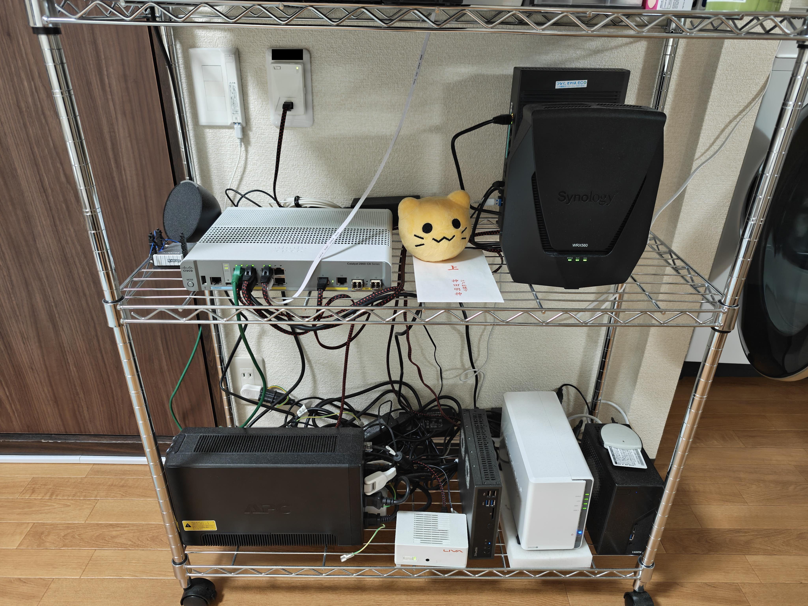


この記事は[Misskey Advent Calendar 2025](https://adventar.org/calendars/11291) 6日目の記事です。


## はじめに

はじめましての方ははじめまして、そうでない方はこんにちは。サンセット([@sunset@mi.sunset0916.net](https://mi.sunset0916.net/@sunset))です。

さんせすきーという小規模なMisskeyサーバーの管理者をやっている美少女 **[要出典]** です。

ありがたいことに、さんせすきーは最近3周年を迎えることができました。  
今回は、無事に4年目をスタートしたさんせすきーの現在の構成についてまとめていこうと思います。

## 物理的な構成

さんせすきーは自宅サーバーをメインに構成されています。

ASRockのDeskMiniをベースとしたマシンで本体を動かし、バックアップ先としてSynologyのNASを使用しています。  
また、停電対策にUPSを採用しています。

本体のスペックはこんな感じ。

| 分類 | パーツ名 |
| --- | --- |
| ベアボーンキット | ASRock DeskMini X300 |
| CPU | AMD Ryzen 7 5700G |
| RAM | DDR4-3200 16GB x2 |
| SSD | SATA 2TB x2 RAID1 |

| 分類 | パーツ名 |
| --- | --- |
| NASキット | Synology DS220j |
| HDD | WD Blue 8TB x2 RAID1 |

| 分類 | パーツ名 |
| --- | --- |
| UPS | APC BR550S-JP |

価格と快適さと入手性で考えた結果ここに落ち着きました。

最近はパーツが高くなってしまったので参考にならないかもしれませんが、自宅鯖を検討している方は情報の一つとして覚えていてもらえたらと思います。

サーバーはMisskey専用ではなく、ProxmoxVEで仮想化してCPU4スレッドとメモリ4GB、SSD300GBを割り当てています。  
詳しい中身はソフトウェア側のところで書きます。

実際の環境の写真はこんな感じです。配線をきれいにしたいです。

## ネットワーク的な話

さんせハウス（アパート）には、共用のギガプライズ無料回線と、自身で契約できるNTTの光コンセントがあり、両方を使用しています。

2つの回線を処理できるルーターということで選択肢が限られますが、私はSynologyのWRX560を使用しています。  
逸般の誤家庭の皆様は業務用のルーターをお使いのことかと思いますが、民生品でも意外となんとかなります。

仮想基盤のサーバー本体への接続には、CiscoのCatalyst 2960CXを通して接続しています。  
こちらはCCNAを取得する際の勉強用に買ったものの流用ですね。

ネットワークに接続されている機器の状態やトラフィックはZabbixで監視しています。  
何かあった際は監視データから故障箇所を調査していく感じです。

自宅回線は固定IPではないため、サーバーの公開にCloudflare Tunnelを使用しています。  
また、外向きに投稿などを配送する場合はOCI上に構築したプロキシサーバーを通しています。

こうすれば自宅のIPアドレスを相手のサーバーに対しても隠すことができるうえ、謎のネットワークの相性も防げます。  
特定のサーバーにだけ配送が届かない場合はお試しください。

## ソフトウェアの構成

さんせすきーは、一般的な自宅鯖でよく使われるDockerでの構築ではなく、それぞれのソフトウェアを自分で用意する方法で構築されています。

| 分類 | 内容 |
| --- | --- |
| OS | Debian 12 Bookworm |
| Misskey | 2025.10.2 |
| Node.js | 22.21.0 |
| PostgreSQL | 16.10 |
| Redis | 8.2.3 |

PostgreSQLにはPGroongaを導入し、日本語検索が高速に行えるようにしています。  
他のサーバーを拠点とするユーザーによると、速い方らしいです。

また、オブジェクトストレージにMinIOを構築しています。

Dockerを使用しない方法は、DBなどのバージョンを自由にできるという強みがあります。  
バックアップ方法も細かく調整できるため、自分で全て調整したい人はDockerを使わない方法のほうがおすすめです。

## 使用している外部サービス

さんせすきーでは、メールの配信にSendGridを、BotプロテクションにTurnstileを使用しています。

また、今までに紹介したもので、サーバーの公開にCloudflare Tunnelを使用し、OCI上にプロキシサーバーのSquidを、自宅鯖内にオブジェクトストレージのMinIOを構築して使用しています。

ほぼ自宅鯖ですが、無料枠の中で効果が高いと感じるものについては、積極的に外部のサービスにも頼っていきます。  
おすすめのものがあれば教えてください。

## おわりに

今回は現在のサーバー環境について書き出してみました。

鯖缶の皆様や、これからサーバーを始めたい方の参考になる情報を提供できていればいいなと思います。

それでは、また次回。
