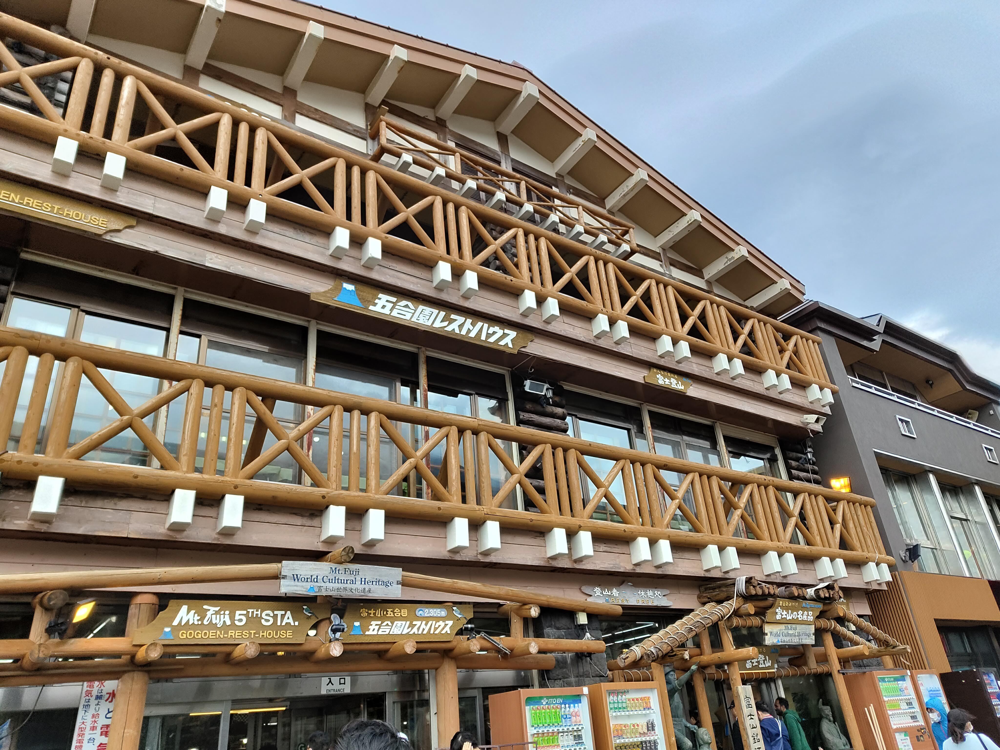
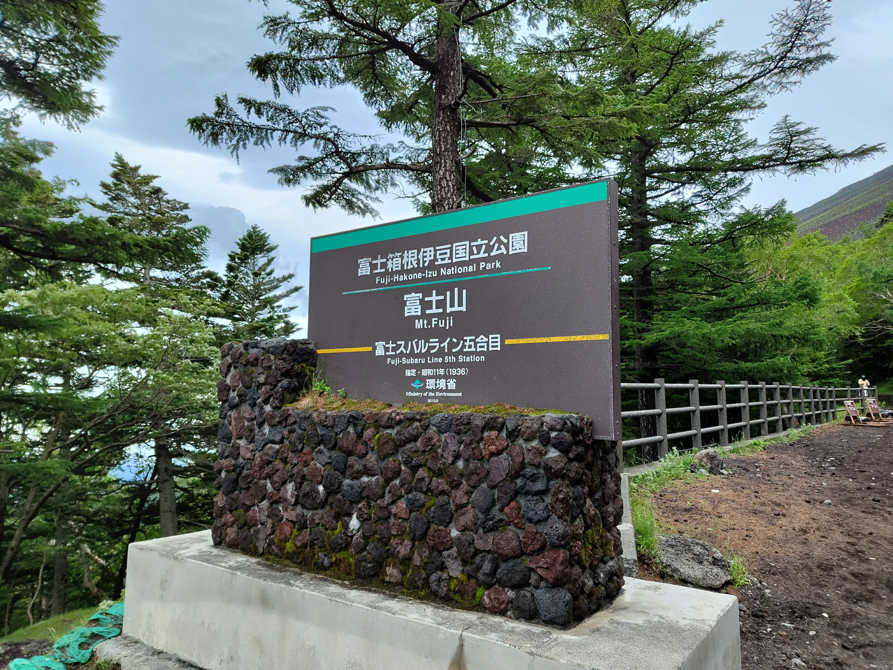
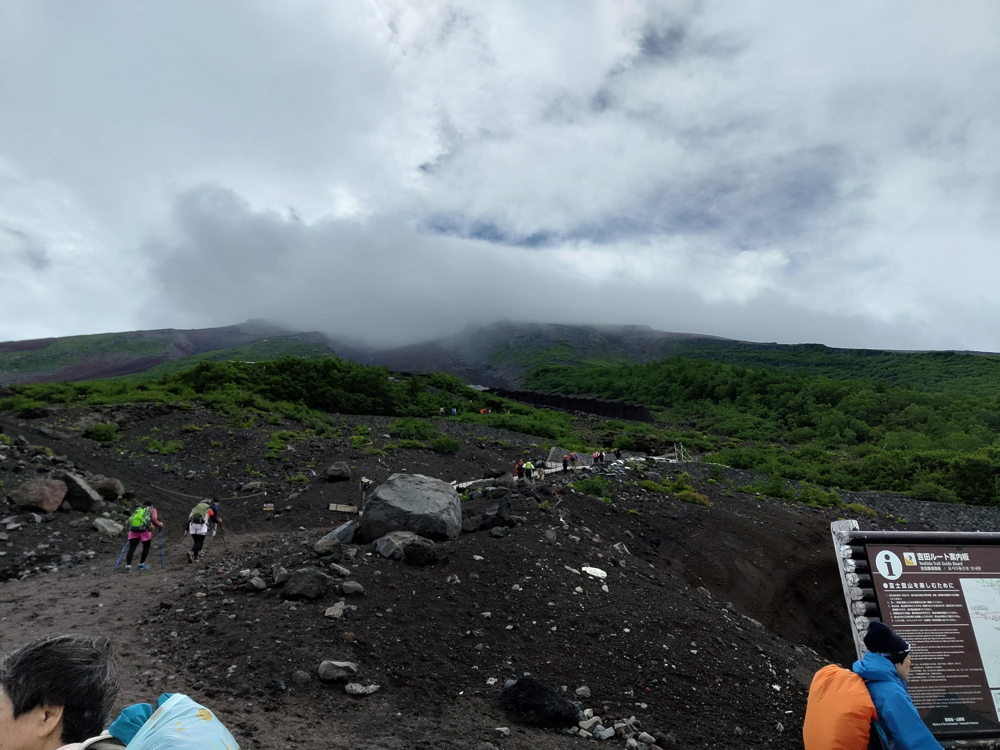
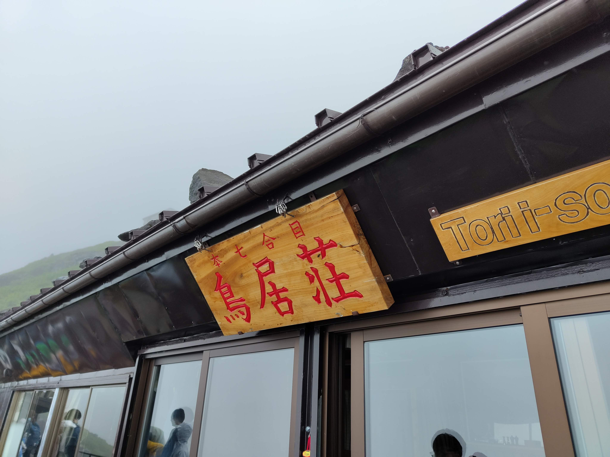
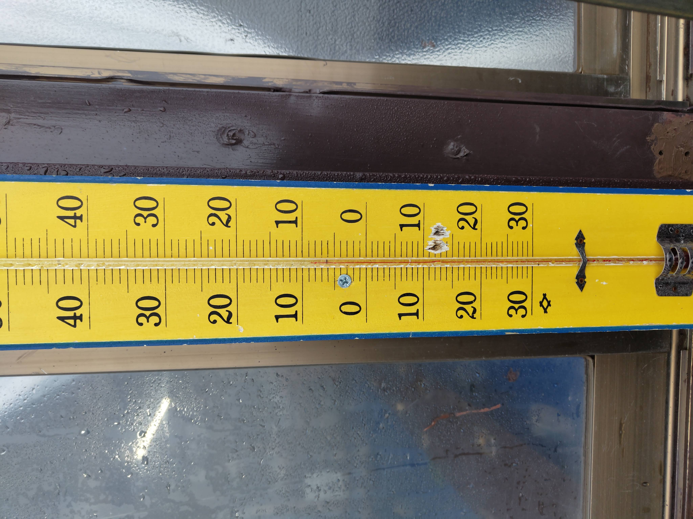
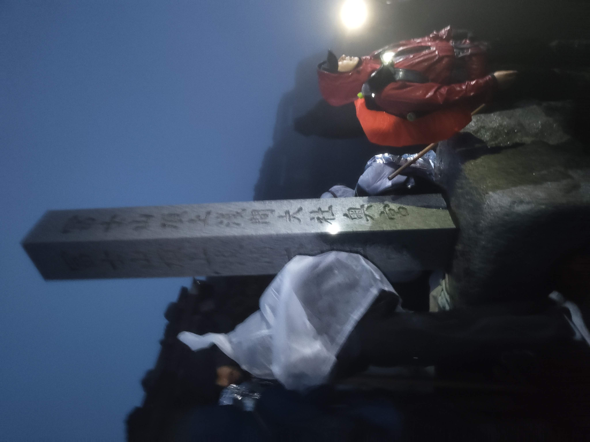
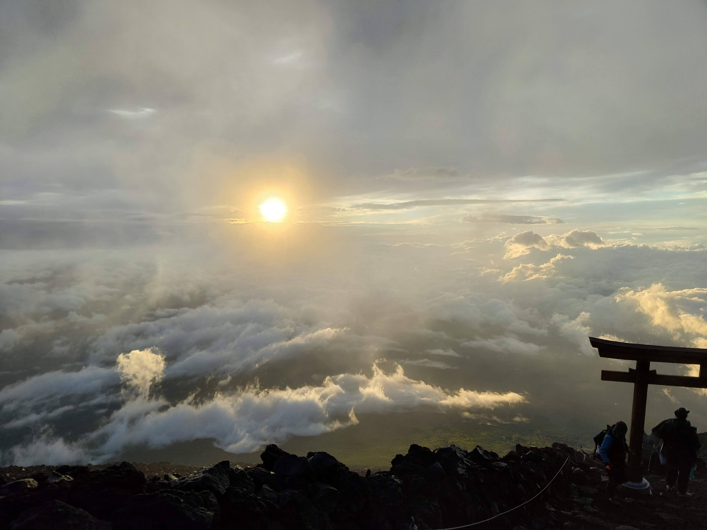
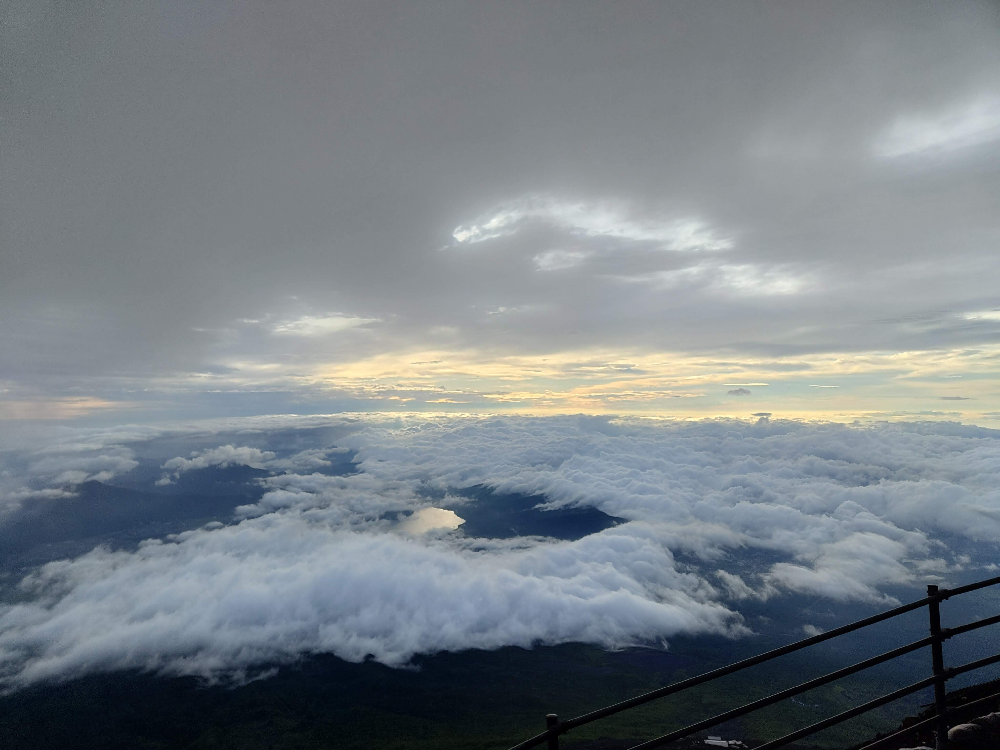

## はじめに

人生で一度は行きたい場所や一度はしてみたいことなど、誰にもありますよね。  
倭国にいれば富士登山やお伊勢参りなどが代表例として上がるでしょうか。

皆さんも行きましょう。真夏の極寒体験に。

## 準備

富士山はルートがしっかりしてるとはいっても日本最高峰です。  
それなりの装備で行かなければなりません。  
以下は登山に必要なものです。

- 登山靴（トレッキングシューズ）
- 雨具（セパレートタイプの合羽など）
- 運動できる服装
- 防寒着、防寒具
- 登山用リュック
- 帽子
- ヘッドライト
- 水（たくさん）
- おやつ（カロリー高めのもの）
- ごみ袋
- 現金（特に100円玉）
- モバイルバッテリー（とてもだいじ）
- タオル
- 杖（ストック）

登山計画や山小屋の確保なども必要なので必ずしておきましょう。  
弾丸登山は事故の元ですよ。

さて前置きはここまでにして登山初心者のサンセットが何を持っていったかというと…

- [ワークマンの靴(1900円)](https://workman.jp/shop/g/g2300053567054/)
- [ワークマンのレインウェア(4900円)](https://workman.jp/shop/g/g2300068516023/)
- 高校の部活のときの服(卓球部)
- 祖母からもらった登山用リュック
- よくわかんないけどリュックにつける雨具
- 小学生のときに被ってた帽子
- [楽天で評価高かったヘッドライト](https://item.rakuten.co.jp/k-power/sq04_c/)
- お茶と水をそれなりに
- カロリーメイト
- 音ゲーマーもびっくりな大量の100円玉
- [Anker PowerHouse 100](https://www.ankerjapan.com/products/a1710)
- タオル3枚
- 祖母からもらった登山用の杖

こんな感じです。登山舐めてますねこれは。

服装はワークマンがコスパ最強と聞いたのでそれで買いました。  
靴と服はこれで問題ないと思います。  
防寒着もレインウェアで十分かもしれないです。  
防寒具は今回持っていきませんでしたが、持っておいたほうが良いです。  
山頂では真夏でも気温が0~5℃で雨が降りやすく、風も20m/sくらいあるので凍えます。  
モバイルバッテリーはポータブル電源じゃなくても大丈夫です。重かったよあれ…  
現金は100円玉も重要ですが、山は物価が高いのでそれに耐えられる金額を持っていきましょう。  
一部山小屋はPayPayなどに対応してますが、無いものとして準備しておきましょう。

## 日程

### 一日目

10:00 富士スバルライン5合目到着  
とても涼しいです。

11:00 出発

11:50 6合目安全指導センター通過

13:30 7合目通過  
天気悪くなって疲れてきた

16:00 8合目山小屋到着  
みてこの気温

### 2日目

2:00 8合目山小屋出発  
暗くて写真撮ってないよー

3:00 8.5合目通過  
暗くて写真撮ってないよー2

3:30 9合目通過  
暗くて写真撮ってないよー3

4:30 山頂到着

5:00 下山開始  
ご来光も見れたのでね

6:00 8合目通過  
いい感じ™な雲海が広がってた

8:30 5合目到着  
スタート地点と同じ

## 完走した感想

さて換装した乾燥ですが、

外出た瞬間終わったわ  
天気悪すぎて進めない  
風強すぎてお亡くなり  
定期定期的に低体温

といった感じで防寒対策がいかに重要か富士山にわからせられましたね。

天気さえ良ければ誰でも山頂目指せるので皆も夏休みに登山、行こう！

ちなみに足の親指の爪は死にました。

## おわりに

さて今回は唐突に富士登山に行って制してきた話でした。  
初心者はインストラクター付きのツアーとかで行こうね。

日本で一番高いところは行ったし次は東西南北の端に行けば良いのかな。

それでは、また次回。
