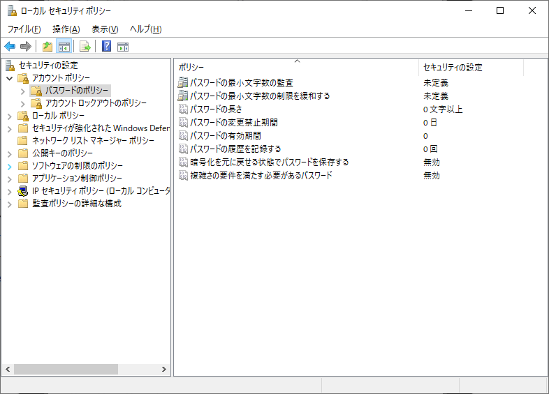
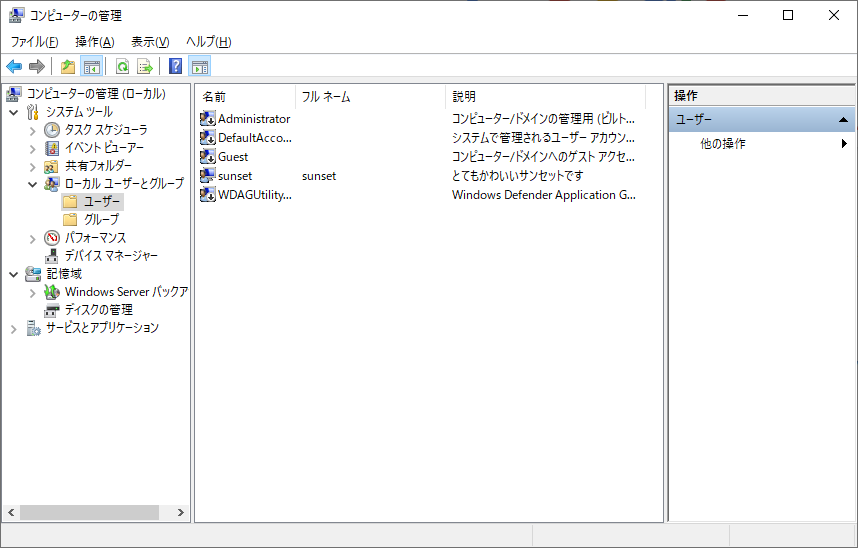
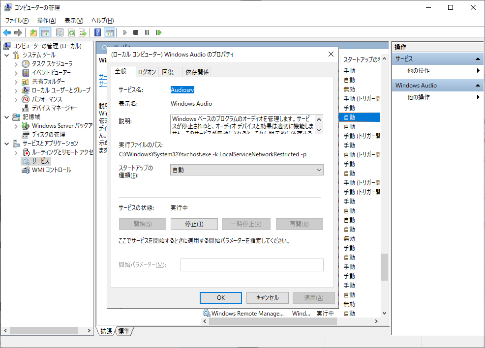
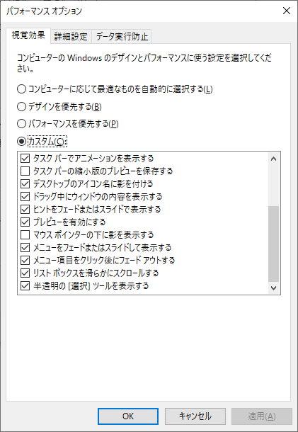
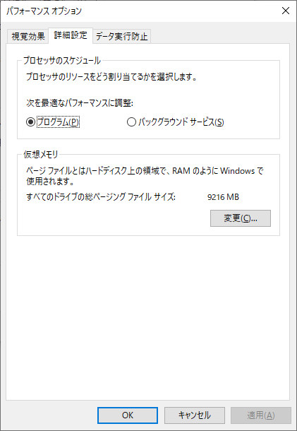
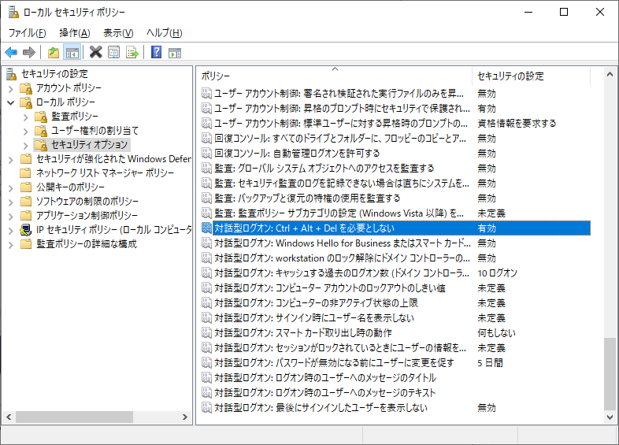
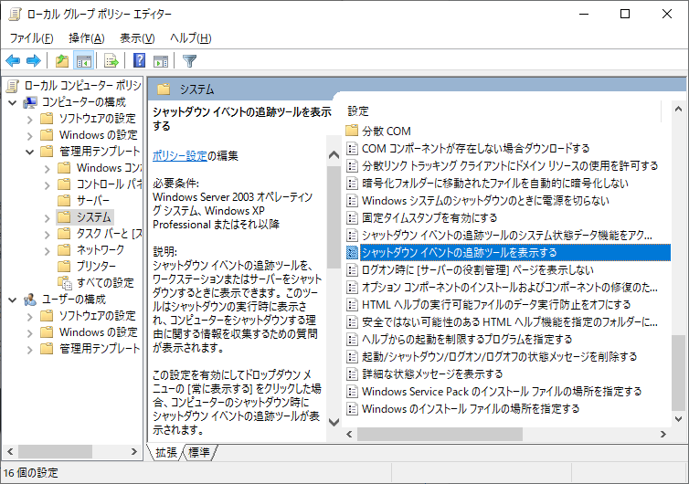

## はじめに

タスクバーは左揃えで結合はしない、スタートメニューはもちろん多用する。  
こんな旧式Windows難民には11は辛すぎる。  
じゃあServerにしちゃおっか。という話。  
前回の自作PCを組んだ話の続きかも。

## 最近のWindows、酷い

最近のWindowsについてどう思いますか？

MSが最後のOSとか自信満々に言ってたWindows10はいつの間にかサポート終了が近づいてきて、今までのWindowsとは違いすぎるWindows11とかいう10の二次創作が出回っているというカオスな現在。  
Windows11も改善は進んでいるらしいですが、Copilotとか広告とかが増えて重くなる一方…  
Windows10難民になりそうな私は考えました。「やっべどうしよ…」と。

Windows10ベースでちゃんとWindows10なデザインのOSを使う方法はいくつかあります。  
次はそれを紹介していきます。

## Windows11を回避して10系を使う方法

[通常のWindows10は2025年10月14日にサポート終了](https://learn.microsoft.com/ja-jp/lifecycle/products/windows-10-home-and-pro)します。通常のはね。  
通常ではないWindows10やWindows10ベースのWindowsServerであればどうでしょうか。  
以下の表にまとめました。

| OS名 | エディション | サポート期限 |
| --- | --- | --- |
| Windows 10 | Home, Pro, Pro for Workstations など | [2025年10月14日](https://learn.microsoft.com/ja-jp/lifecycle/products/windows-10-home-and-pro) |
| Windows 10 | Enterprise LTSC 2019 | [2029年1月9日](https://learn.microsoft.com/ja-jp/lifecycle/products/windows-10-enterprise-ltsc-2019) |
| Windows 10 | Enterprise LTSC 2021 | [2027年1月12日](https://learn.microsoft.com/ja-jp/lifecycle/products/windows-10-enterprise-ltsc-2021) |
| Windows Server 2016 | Standard, Datacenter など | [2027年1月12日](https://learn.microsoft.com/ja-jp/lifecycle/products/windows-server-2016) |
| Windows Server 2019 | Standard, Datacenter など | [2029年1月9日](https://learn.microsoft.com/ja-jp/lifecycle/products/windows-server-2019) |
| Windows Server 2022 | Standard, Datacenter など | [2031年10月14日](https://learn.microsoft.com/ja-jp/lifecycle/products/windows-server-2022) |

こんな感じでWindows11の後継が出そうな時期までサポートがあるものが意外と存在しています。

LTSCであればストアが無いくらいであとは普通のWindows10に近いので入手できればいい感じかもしれません。  
ストアも[無理やり入れる](https://github.com/GFOXSH/LTSC-Add-MicrosoftStore-2021)ことはできますしね。

まあ今回はLTSC使わないんですけど。

## Windows Server 2022 Datacenterを採用した理由

見出しの通りですが、今回はWindows11を回避するためにWindowsServerを選びました。  
理由は以下の通り。

- サポートが長い(2031年10月14日まで)
- ベースが最近のWindows10(ビルド番号的には10と11の間)
- サーバー用なので何も入ってない(綺麗な環境)
- Azure for Studentsでライセンス無料
- 勝手に再起動されない

最近のWindowsにある余計なものが入っていたり勝手に再起動されたりという問題を回避するのにちょうどいい感じになっているのではないでしょうか。

もちろんサーバー用OSなので、通常のPCとして使うには不便な点もいくつかあります。  
WindowsHelloが使えなかったり一部ソフトがインストールできなかったりなど…

今回はそれらのデメリットよりもメリットの方が大きいと判断したためWindowsServerを選んだ感じです。  
StandardではなくDatacenterを選んだ理由は…特になし！強そうだから！

## Windows Server 2022を常用するためにしたこと

WindowsServerはサーバー用のOSなので初期設定のままではPCとして使うには不便な点が多いです。  
設定をWindows10に近い状態に変更し、必要なものをインストールする必要があります。  
ここでは私がWindowsServer2022を常用するためにしたことを書いていきます。

### パスワード制限の無効化

WindowsServerでは強力なパスワードと定期的な変更が求められるのですが、PCとして使う場合は邪魔なので無効化してしまいます。

ローカルセキュリティポリシーの設定から有効期間や複雑さの要件などを無効にしておきます。  
以下のスクショのようになっていれば大丈夫です。



### Administratorを無効化

Windows10ではデフォルトで無効化されているAdministratorですが、WindowsServerではデフォルトのアカウントとして存在しています。

このままでは権限の問題などが発生するため、コンピューターの管理からAdministratorsグループに所属させたユーザーを作成し、それを使用するようにします。  
Windows10の管理者権限を持つオフラインユーザーと同じような感じですかね。  
ユーザーを作成したらAdministratorは無効化してしまいましょう。  
以下のスクショのようになっていれば大丈夫です。



### 音声の有効化

WindowsServerはサーバー用OSなのでデフォルトのままでは音が出ません。  
PCとして使っていくうえで音が出ないのは致命的なので出るようにしていきます。

コンピューターの管理からサービスの管理を出し、Windows Audioを自動で起動するようにし、その場で起動もしておきます。
以下のスクショのようになっていれば大丈夫です。



### WiFiの有効化

WindowsServerはサーバー用OSなのでWiFi機能もありません。  
WiFiを使用したい場合は以下のコマンドを管理者権限のPowerShellで実行します。

```PowerShell
Install-WindowsFeature -Name Wireless-Networking
```

ここで一度再起動してもう一度管理者権限のPowerShellを立ち上げて以下を実行。

```PowerShell
Set-Service WlanSvc –startuptype automatic –passthru
Start-Service WlanSvc –PassThru
```

あとはアダプタが有効化されていればWindows10のようにWiFiが使えるはずです。

### GUIをいい感じ™に

WindowsServerはサーバー用OSなのでGUIを有効にしてあってもアニメーションなどがほぼ無い軽量な状態になっています。  
これで使いたい人はこれで問題ないですが、Windows10と同じ状態にしたい場合は設定で変えておきましょう。

システムの詳細設定からパフォーマンスの設定を変更します。  
スクショの無効になってる部分以外全部有効にしておけばWindows10と同じになるはずです。



### サービスの優先度を変更

WindowsServerはサーバー用OSなのでバックグラウンドプロセスが優先的に処理されます。  
普通のPCとして使う場合はフォアグラウンドのプロセスにリソースを当てたいことが多いので設定で変えておきましょう。

システムの詳細設定からパフォーマンスの設定を変更します。  
スクショのようにプログラムにチェックを入れておきます。



### メモリ圧縮の有効化

メモリを効率良く使うために有効化しておきます。

管理者権限のPowerShellで以下のコマンドを実行します。

```PowerShell
Enable-MMAgent -MemoryCompression
```

### サインイン時のCtrl+Alt+Del無効化

サインイン時に毎回Ctrl+Alt+Delを要求されると面倒なので設定で無効化してしまいましょう。

ローカルセキュリティポリシーの設定から無効にできます。  
以下のスクショのようになっていれば大丈夫です。



### シャットダウン追跡の無効化

シャットダウン時や電源切断時に毎回理由を聞いてくるのはうざいので無効化してしまいましょう。

ファイル名を指定して実行から`gpedit.msc`を開いて、以下のスクショの場所にある設定を無効にします。



### タスクマネージャーにディスク使用率を追加

WindowsServerのタスクマネージャーはデフォルトではとても情報が少なくなっています。  
ディスク使用率はコマンドで有効化できるのでしておきましょう。

管理者権限のPowerShellまたはコマンドプロンプトで以下のコマンドを実行します。

```PowerShell
diskperf -y
```

### Windowsフォトビューアーを有効化&規定に

WindowsServerはWindows10以降にプリインストールされているフォトが存在しません。  
後述するUWPの自力インストールで入れても問題ありませんが、私はWindowsフォトビューアーの方が好きなのでこれを有効化して規定のアプリに設定します。

[このサイト](https://qwerty.work/blog/2020/04/windows10-photoviewer-enable.php)の方法が参考になるのでいい感じ™にやってください。

### winget導入

Microsoftが開発しているWindows用のパッケージマネージャーであるwingetを導入します。  
scoopやchocolateyなどでも大丈夫です。  
パッケージマネージャーがいらない人は入れなくてもいいです。

wingetを導入するには以下のコマンドをPowerShellで実行します

```PowerShell
Set-PSRepository -Name 'PSGallery' -InstallationPolicy Trusted
Install-Script -Name winget-install -Force
winget-install.ps1
```

再起動したら使えるようになっているはずです。

### UWP自力インストール

WindowsServerにはWindows7に搭載されていたもののような古くてボタンの小さい電卓がプリインストールされています。  
電卓に限らず、Windows10にプリインストールされているUWPアプリの方が便利なことが多いため、必要なものを手動でインストールしていきます。気合いで。

手順は以下の通りです。

1. [https://store.rg-adguard.net/](https://store.rg-adguard.net/)にアクセスする
2. インストールしたいアプリのURLを入れる
3. 出たリンクのうちアーキテクチャの一致する依存関係と本体をダウンロードする
4. インストールする

ダウンロードのときは以下のコマンドを、

```PowerShell
irm "http://example.url" -o filename.appx
```

インストールのときは以下のコマンドを実行します。

```PowerShell
Add-AppxPackage .\filename.appx
```

これでストアのUWPアプリをインストールできるはずです。

## やっても無駄だったこと

LTSCにMicrosoft Storeを無理やりインストールするスクリプトをServer2022に対して実行したところ、ストア自体はインストールできたがストアからアプリのインストールができないという状況になった。

アプリが入れれないストアなんて存在価値は無い！

## Windows Server 2022でできること、できないこと

WindowsServerはサーバー用OSなので無効化されていたりしてできないこともいくつかあります。  
ここでは私が確認できた範囲のことを書いていきます。

### できること

できないこと以外全部

### できないこと

- Windows Helloによるサインイン
- Microsoftアカウントによるサインイン
- 一部ソフトのインストール(AMDのドライバやCanonのツールなど)
- 有線のOculus Link
- ストアがソースになっているアプリのインストール(winget)
- Xbox系のサインイン
- などなど…

## おわりに

今回はWindows Server 2022をPC用OSとして使う話を書きました。  
学生でWindows Serverのライセンスを入手できる人は遊んでみては？

それでは、また次回。

## 参考文献

- [Windows Server 2019を通常のWindows 10のようにして使う](https://ideal-reality.com/computer/windows/windows-server-2019-workstation/)
- [【Windows Server 2019/2016】ワイヤレス接続　Wi-Fiを有効にする方法【Tips】](https://zeropasoakita.livedoor.blog/archives/40273990.html)
- [【図解】Windows Server 2019のタスクマネージャーにディスク使用率を表示させる方法](https://inab818.site/microsoft-windows-server-2019/diskperf-command/)
- [【Windows10】フォトビューアーを既定のアプリとして使うためにレジストリで有効化する方法](https://qwerty.work/blog/2020/04/windows10-photoviewer-enable.php)
- [Installing Appx Without Microsoft Store](https://christitus.com/installing-appx-without-msstore/)
