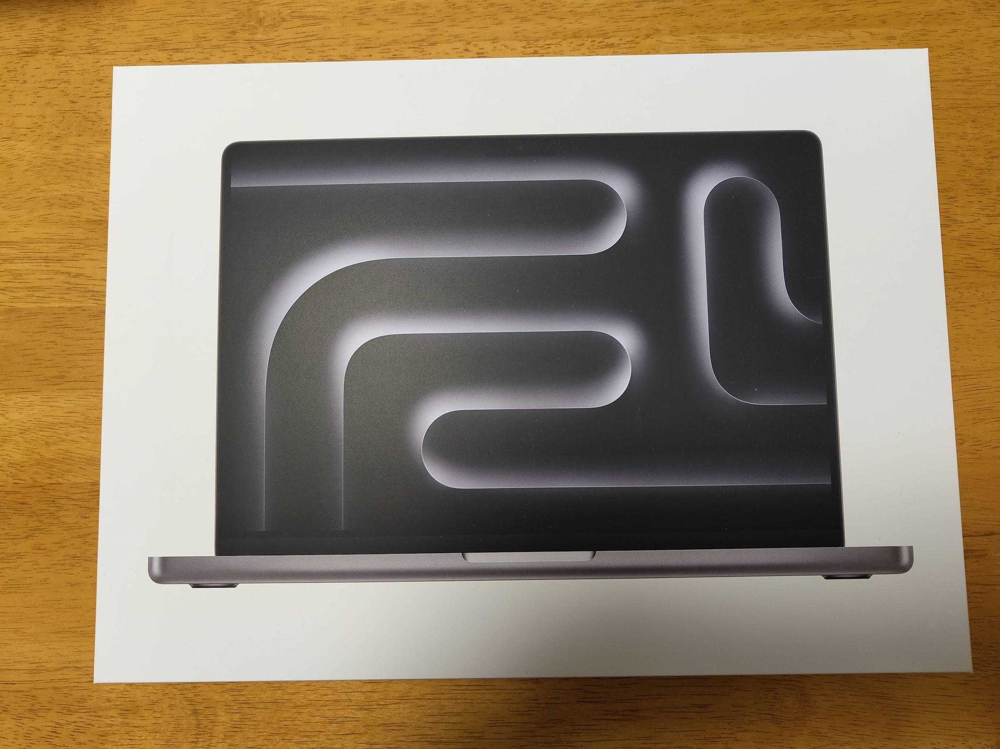
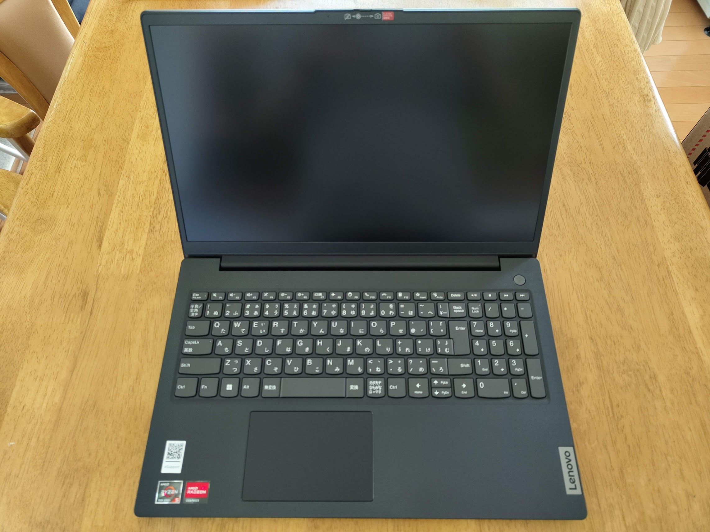
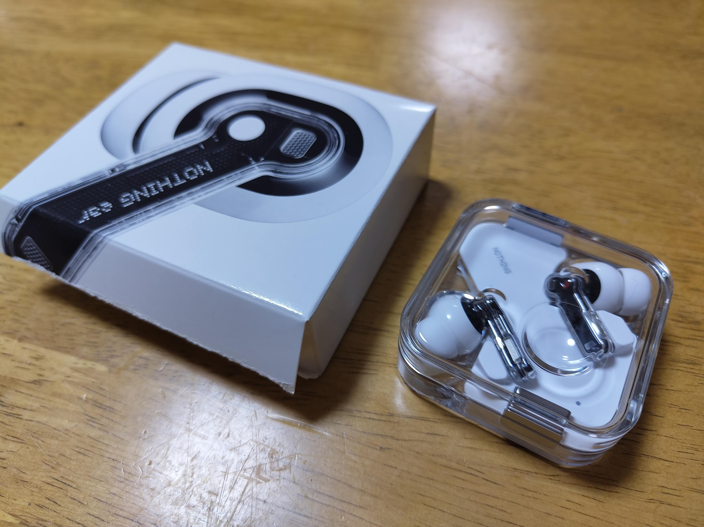
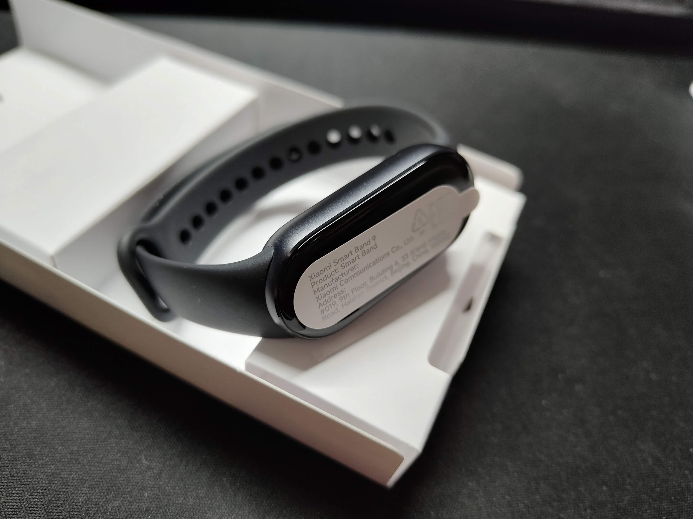
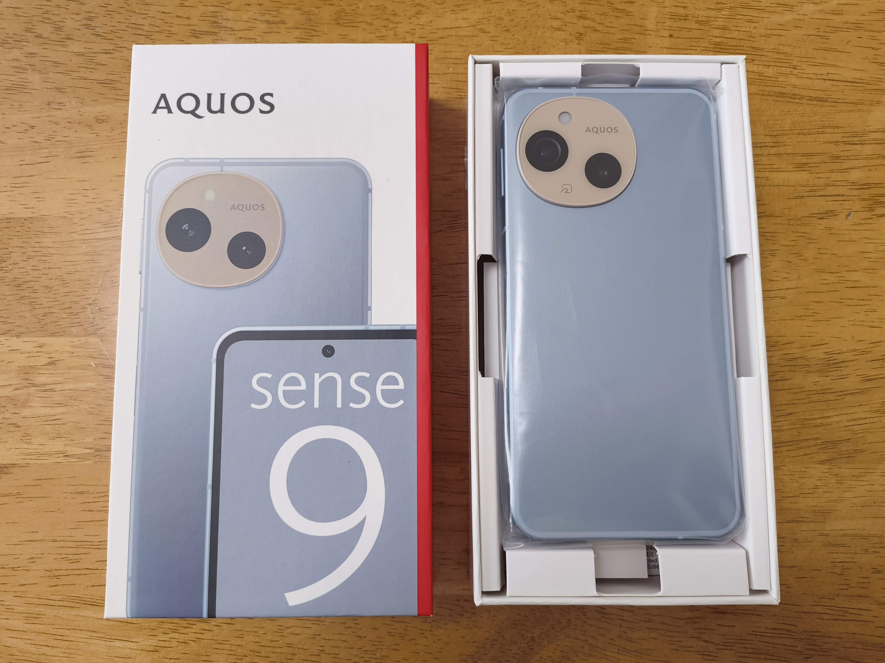
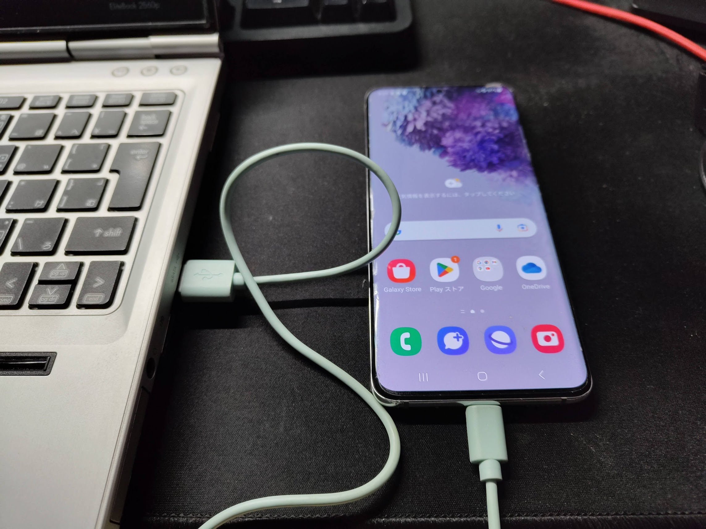
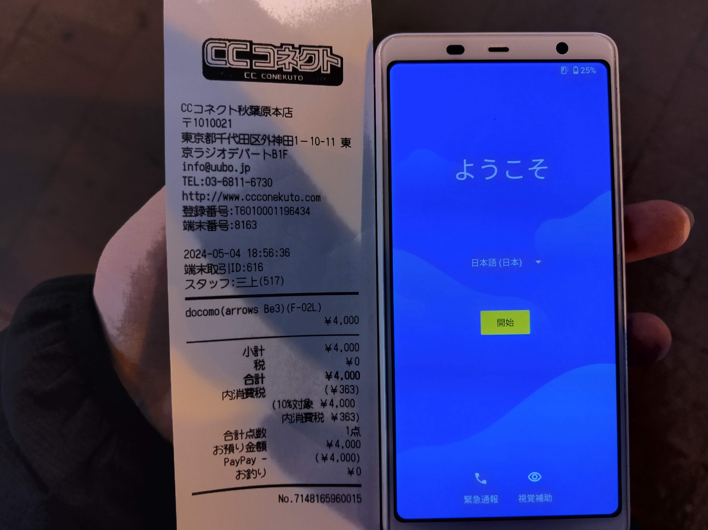
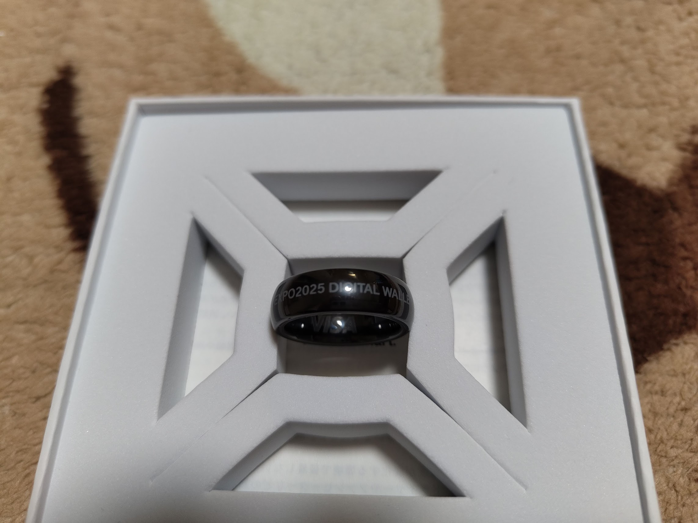
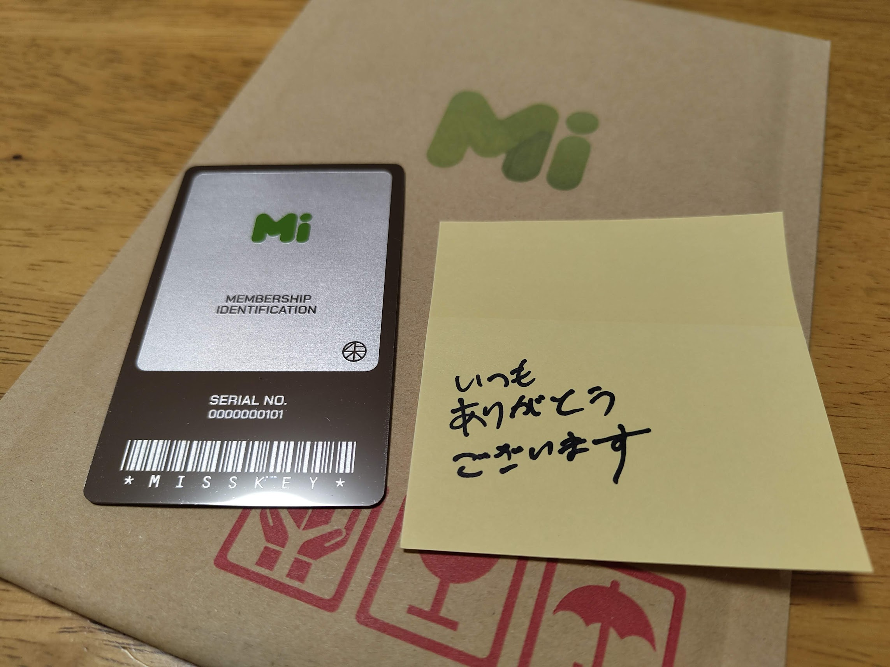

## はじめに

2024年ももう終わりということで、今年何を買いどう使ってきたのかを振り返りたいと思います。

今年は円相場が大きく動き、為替レートに価格が左右される電子機器の購入を趣味とする人には厳しい年でした。

きっと自制して散財額もそこまで多くないことでしょう…

## DeskMini X300とその他パーツ

今年最初に散財したのがこちら、DeskMiniを使った現在のメインサーバーです。

スペックはRyzen7-5700G/32GB/2TBx2という自宅鯖にしては比較的つよつよの構成。

現在サンセットの自宅でMisskeyや録画鯖、Minecraft鯖など様々なサーバーをこれ1台で動かしています。

全部合わせて9万3000円ほどでした。

これまで使ってきて価格に対して足りない点や不満はないので良い散財だったと思います。

## MacBook Pro M3 2023 16GB/512GB

学生最後の年だからという理由で購入したのがこのMacBook Pro。

これまでは2020年のM1搭載モデル(8GB/256GB)を使っていましたが、仮想マシンや開発環境を同時に複数立ち上げるため若干のメモリ不足と、仮想マシンによってストレージ不足を起こしていました。

使い方次第でなんとでもなったのですが、ちょうどいい機会ということで毎年春に開催されるAppleの学割キャンペーンで購入しました。

価格は25万8000円でした。高い！

本体の品質から性能からあらゆる面で不満はありません。MacBookは生活インフラです。

ちなみにこれが届いた数日後にM3モデルのMacBook Airが発売され、妹はこれを購入しています。

Proを買ったこと後悔はしていません。だってスピーカー良いし画面ヌルヌルだしHDMIとSDカード挿さるし！！！

## Anker 347 Power Bank

40000mAhのクソデカモバイルバッテリーです。

サンセットはこれまでAnker PowerHouse 100という27000mAhでAC100Vが出るタイプのクソデカモバイルバッテリーを使っていました。

しかし使用年数のせいでまともに動かなくなってきたのでほどほどの価格の中でデカいやつを買ったというわけです。

デカすぎるが故にかばんの中で確実に下にずり落ちるせいで傷がつきやすいのでちょうどいいサイズのケースを探した話は以下のリンクから。



お察しの通りとても重いので普段はあまり持ち歩いていません。

緊急時はMacBookから充電することが多いですからね…

価格は1万円弱でした。まあほどほどの値段。

## Lenovo V15 Gen4

外装が安いかわりにスペックがまあまあ高いLenovoのThinkでもIdeaでもないPC、それの価格.com限定モデルです。

祖母がこれまで使っていた低電力版第4世代i3/メモリ4GB/HDDなノートPCの動作があまりにも重すぎたので購入しました。

Lenovoの他シリーズと違って全体的に安っぽいプラスチックで強度は無さそうなモデルですが、今回は据え置きかつライトな使い方なので問題ないと判断しました。

価格は約6万6000円でした。詳しいレビューは以下のリンクから。



しばらく使っていますが性能など一切不満はありません。なにせソリティアくらいしかしませんから。

## Nothing Ear

サンセットが今一番推している電子機器メーカーのNothing。そこの最新フラグシップイヤホンです。

Nothingのイヤホンはフラグシップモデルとしては3代目、低価格帯も含めれば更に多くのモデルを出したこともあって非常に洗練されてきたイメージがあります。

最初に出たEar(1)の時点で高評価だったため最新のEarはサンセットからすれば文句のつけようがないレベルです。

ひとつ不満な点を挙げるとすれば単体での連続駆動時間ですかね。

以前使っていたKZのAZ09 Proは耳掛け型リケーブルTWSということでバッテリーのサイズが大きく、ANCもないため単体駆動時間がとても長く一度もバッテリー切れを起こしたことがありませんでしたが、Nothing Earでは流石にサイズの関係でバッテリー切れギリギリになることが増えました。

それでも他のイヤホンと同等ではあるので特別デメリットとは思っていません。以前より音質やANCなど良い体験を得られているのでプラスに考えています。

価格はAmazonのセールで1万6000円弱でした。定価が2万円を超える機種なのでとてもお得でしたね。

## Xiaomi Smart Band 9

サンセットが毎年新型が出た瞬間に買い替えるスマートバンドのXiaomi Smart Bandシリーズ、それの最新作です。

前作の8からバンドの取り付け方法が変わり、Apple Watchよりも付け外しが楽になり不満点はひとつもありませんでしたが、今度はスペック面で8を超えて最高を塗り替えてきました。

価格は定価の6000円弱でした。詳しいレビューは以下のリンクから。



## CMF Phone 1

サンセットイチオシメーカーのNothingのサブブランドから出た低価格スマホ、CMF Phone 1です。

予約購入で発売日から今まで使っていたNothing Phone(1)の画面内指紋認証が壊れてしまい、不便になってしまったのでPhone(3)が出るまでのつなぎとして購入しました。

CMF Phone 1購入まではGalaxy S20を使っていましたが、NothingOSの便利さに慣れすぎていてGalaxyが微妙に感じてしまったのでNothingOSを求めてCMFにといった感じです。

この機種は超広角カメラやNFC、防水防塵といったスマホにそこそこ必要な要素が欠けているためサブ機やライトユーザー向けです。

サンセットはたいして写真取らないし支払いは全部iPhoneでするので今のところは問題なく使えています。

価格はAliExpressで3万4000円ちょいでした。はやくPhone(3)出てくれ〜…

## AQUOS sense9

senseは微妙という風潮を完全に破壊して良すぎるというレベルまで引き上げてきたSHARPの最新国民機、AQUOS sense9です。

サンセットはこれまでAQUOS sense, sense4, sense8, sense9を購入してきたAQUOS senseシリーズユーザーですが、senseシリーズを使って感動したのはsense9が初めてです。

sense9は物理的なカメラの構成がR9と共通になったり、画面が最大疑似240Hzになったり、ハプティクスが単なる振動から上位モデルのようなものに変更されたり、スピーカーがステレオかつボックス型になったりと各所で体験の質を向上させるようなアップグレードがされています。

sense8までは明確にアップグレードされた箇所があってもバイブや画面、スピーカーなどから低価格モデル感を感じていましたが、sense9では細部から良くなっており、低価格モデル感を感じない仕上がりでした。

これらの点はsense9のレビューをしている人のブログを読むとより細かく知れるかもしれません。サンセットが語りだすと長くなりそうなのでここで止めておきます。

価格はIIJmioのMNP割引で4万円弱でした。この価格でこの感動、SHARPさんありがとう。

## 番外編

ここからは散財をしたけど散財と呼べないものや、そもそも散財してないけど入手したものを軽めに書いていきます。

### Galaxy S20 5G SC-51Aa

スマホ修理店の店員をやっていると修理以外のSOSを意外と多く対応します。

このGalaxy S20はパスワードがわからないまま強制初期化によってGoogleのFRPロックがかかった状態で売却も処分もできない状態の端末でした。

どうにか処分だけでもできないかと修理店に持ってきたわけです。

本来ならFRPがかかった状態は盗難品の可能性などから警戒すべきですが、今回は証拠が揃っているうえに修理店ということで分解してパーツごとに捨ててしまえばいいので快く無料回収サービスすることにしました。

回収したはいいものの捨てるのはもったいないので上司にあたる社員を口封じして端末を貰ってきました。

FRPがかかったSamsung製端末でやることといえばただ一つ、FRP解除です。

怪しいツールを使うなどして見事に解除できたので今はサンセットの手元で使ったり使わなかったりしています。

### arrows Be3 F-02L

秋葉原のラジオデパートにあるCCコネクトではよくガチャというかくじというかそういう企画をやっています。

4000円であたりだと折りたたみのスマホがあり、外れだと今は全く使えないようなものが入っているというロマン企画。やるしかないでしょ。

引いたものがこちら、arrows Be3です。(中古価格4〜5000円)

なんというかあたりでもはずれでもない微妙な結果でした。

とりあえずarrowsということで風呂に入れても問題ないので風呂スマホとして使っています。

このあと別の日に引き直したところまたarrows Be3が出たので山Dに押し付けました。

もう引きません。

### EVERING

万博のキャンペーンで無料で貰ったEVERINGです。

EVERINGはVISAタッチ扱いで使える指輪型のプリペイドカードです。

丸亀製麺みたいな支払いに時間をかけたくない場面で便利だなと思って使ってみましたが、これを付けているとお箸がうまく持てないので使うのをやめました。

サンセットは個人的にこれを「ミャクミャク様と一生一緒エンゲージリング」と呼んでいます。どうでもいいですね。

### MisskeyIDカード

Misskey(ioではない)のプロジェクトに2万円以上寄付をするともらえる金属製のカードです。

Misskey(ソフトウェア)はいつも自宅サーバーで使わせて貰っているのでプロジェクト維持に使ってもらいたいという思いで2万円寄付し、カードを貰いました。

サンセットの番号は101なのですが、多方面から「素数」とリアクションを付けられ、みんな素数好きなんだなと思いました。

101は10進数でも16進数でも2進数でも素数みたいですね。面白い。

### ARROWS Tab Q508/SE

いわゆる学タブと呼ばれるもののひとつ、文教モデルのアロタブです。

Atom x5-z8550/4GB/64GBという今では時代遅れの性能ですが、筆圧対応のスタイラスペンとWindowsの内蔵ライセンスが付属し、バッテリーもほぼ使われていない状態で2800円ということでおもちゃとして購入。

Windows 11 Proを入れ、全力でドライバを当てた結果タブレット端末として性能は低いですが、それなりに使えるレベルになりました。

しかしサンセットはM1モデルのiPad Airを使っているので現状このアロタブの用途はありません。

なにか良い使い道があれば教えて下さい。

### LG WING

キモいスマホを作るメーカーの代表格といえばLG。そのLGが作った特に異質なスマホがWINGです。

真ん中の特別異質なやつがWINGです。

2Duoから送料など合わせて2万6000円弱で譲ってもらいました。

WINGのことはみんな知ってると思うので詳しいことは書きませんが、とてもキモくて良いです。最高です。

来年はもっとキモいスマホを手に入れたいですね。

## おわりに

ここまで今年の散財を書いてきました。

思ったより散財していましたね………。合計でいくら使ったかは怖いので計算しません。

来年は就職にあたって賃貸を借りて家具や家電を買うのでこれまでとは比べ物にならい金額が動くのかなと思います。怖くて夜しか眠れません。

今後の散財はサンセットの給料次第ですね。

2024年もありがとうございました。皆様良いお年を。

それでは、また次回。
