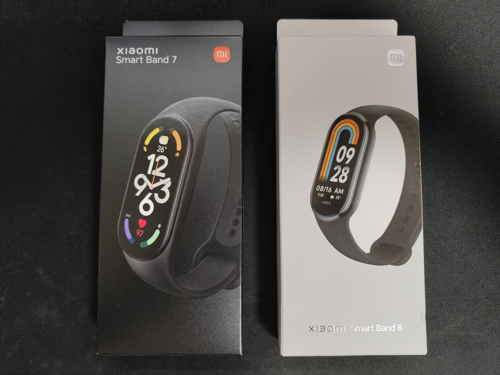
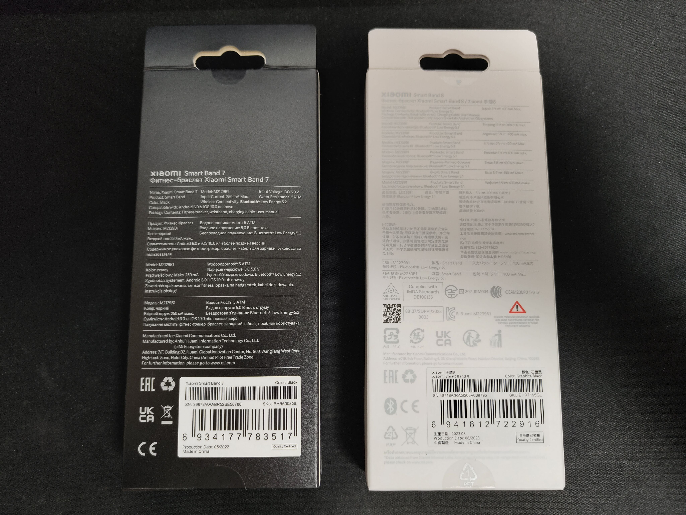
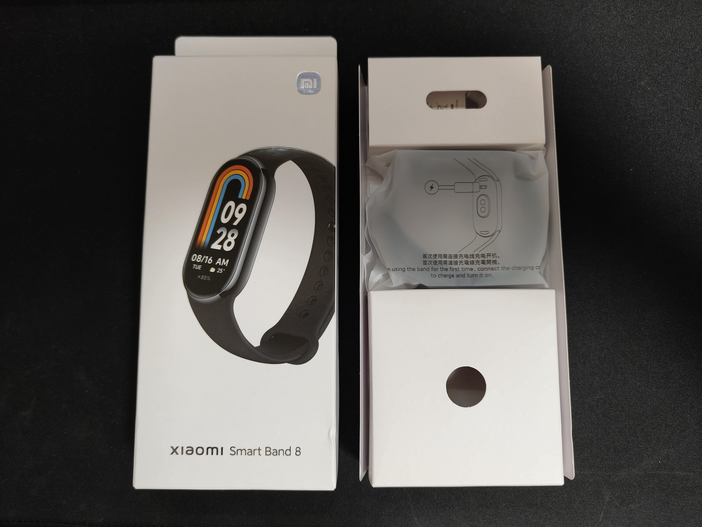
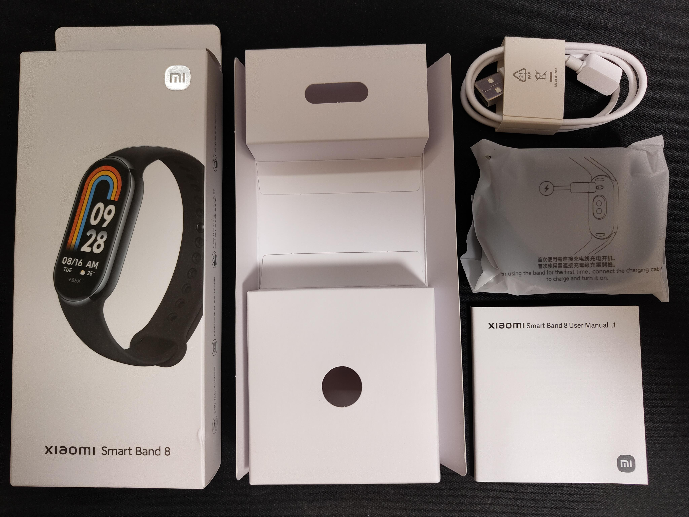
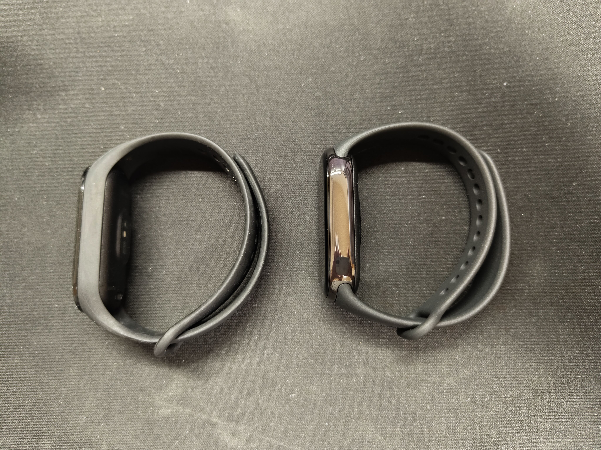
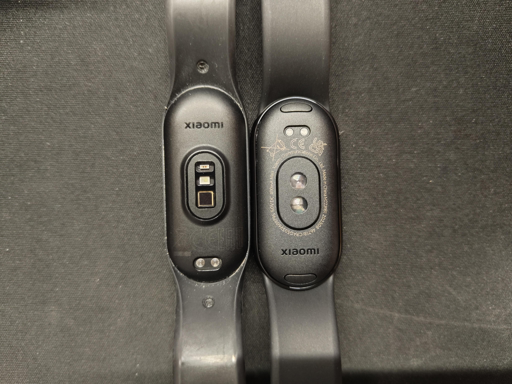
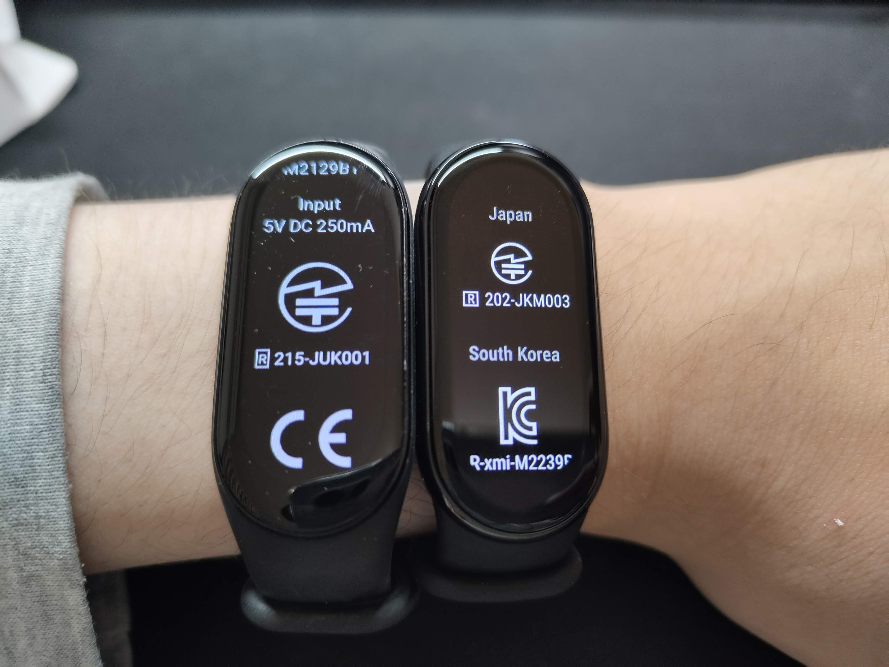
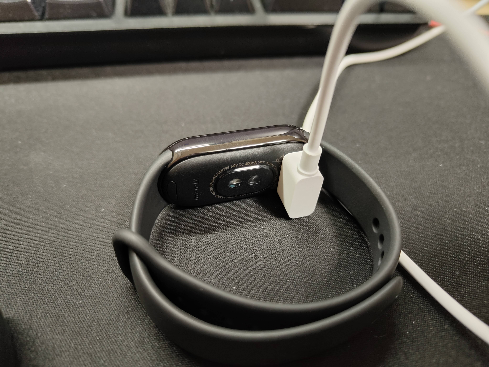
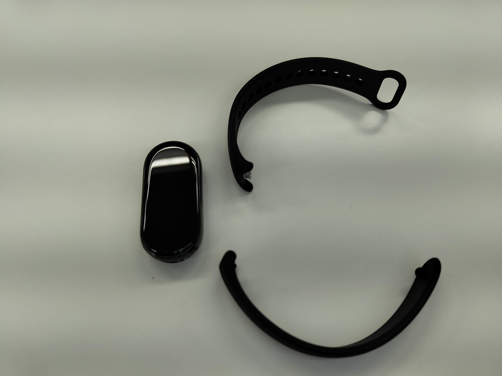

## はじめに

個人的にはhuamiとか70maiとかのデバイスは日本語のフォントや改行が微妙なので英語で使いたいんですよ。

Xiaomiのスマートバンドは価格の割に完成度が高くて日本発売前から使っているわけですが、今まですべて技適に通過していて日本語に非対応のグローバル版を英語で使ってきました。

今回も同じだろうと思いAliExpressのXiaomi公式ストアからグローバル版を購入したのですが…

今回は前作と比較する形で見ていきます。  
前作のレビューは[Fascodeのブログ](https://blog.fascode.net/2022/07/08/xiaomi-smart-band-7/)からどうぞ。

## パッケージ比較

意味はないかもしれませんが前作のXiaomi Smart Band 7のパッケージと比較します。

正面はこんな感じ。

今まで黒ベースだったパッケージが白ベースに変わりました。  
あとはいつものXiaomiって感じですかね。

背面はこんな感じ。

これもいつも通りのXiaomi…  
なんか日本語書いてないこれ？

そろそろお気づきのことかと思いますが、なんとグローバル版と日本版が統合されてしまいました。

専用アプリのMi Fitnessは言語設定ができないので端末の言語に合わせて日本語になってしまいますね…  
残念！

## 開封

パッケージだけ眺めてもつまらないので開封していきましょうか。

開けるとこんな感じ。

更に開けていくとこんな感じ。

見慣れない白い充電器以外はいつも通りですね。

## 本体

7と比較したりしなかったりしながら見ていきます。  
並んでいるときは右側が8になります。

側面

センサー面

画面(と技適表示)

8からは充電器が変わり、白くなりました。  
形状も少し変わり、Surfaceの充電器っぽくなりましたね。

8の最大の特徴として、バンドの外し方が変わりました。  
Apple Watchみたいにボタンを押して外すタイプですが、こちらはスライドではなく簡単に外すことができます。  
個人的には控えめに言って最高だと思います。

## おわりに

Xiaomi Smart Band 8、本体は60Hz対応や明るさ調整対応など、めっちゃ進化してしても良いんですが、アプリや言語が不自由になってしまった点が少し残念といった感じですね。

今後のアプリの改善に期待したいと思います。

今回はAliExpressで¥4,995で購入しましたが、Amazonで¥5,990で売っているものと中身は同じなので好きな方を買えばいいと思います。  
両方とも技適はあるので。

ブログっぽく最後に商品URLだけ貼っておきますね。  
もちろんアフィリエイトで（（（

それでは、また次回。

[Xiaomi Smart Band 8 Global Version (AliExpress)](https://ja.aliexpress.com/item/1005005929125867.html)

[Xiaomi Smart Band 8 (Amazon)](https://amzn.to/3RWobRw)

<a href="https://www.amazon.co.jp/%E9%80%B2%E5%8C%96%E3%81%97%E3%81%9F%E3%83%87%E3%82%A3%E3%82%B9%E3%83%97%E3%83%AC%E3%82%A4-16%E6%97%A5%E9%96%93%E6%8C%81%E7%B6%9A%E3%83%90%E3%83%83%E3%83%86%E3%83%AA%E3%83%BC-%E3%82%AF%E3%82%A4%E3%83%83%E3%82%AF%E3%83%AA%E3%83%AA%E3%83%BC%E3%82%B9%E6%A7%8B%E9%80%A0-150%E7%A8%AE%E9%A1%9E%E3%82%B9%E3%83%9D%E3%83%BC%E3%83%84%E3%83%A2%E3%83%BC%E3%83%89-%E7%9D%80%E4%BF%A1%E9%80%9A%E7%9F%A5%E3%83%BBLINE%E3%82%A2%E3%83%97%E3%83%AA%E9%80%9A%E7%9F%A5/dp/B0CD2MP728?crid=3I8KFVE3LEFI5&keywords=xiaomi%2Bsmart%2Bband%2B8&qid=1696994908&sprefix=xiaomi%2Caps%2C174&sr=8-1-spons&sp_csd=d2lkZ2V0TmFtZT1zcF9hdGY&th=1&linkCode=li1&tag=sunset0916-22&linkId=9d3688af42dc54e3b68c5bd3aa273d3a&language=ja_JP&ref_=as_li_ss_il" target="_blank"></a>
