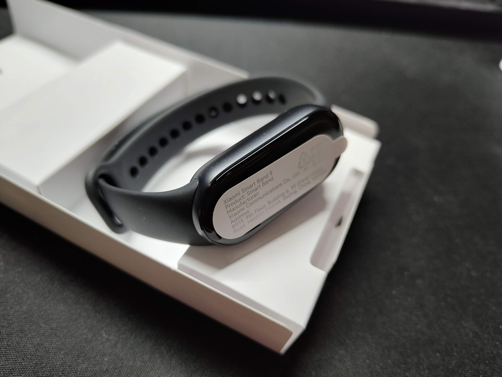

## はじめに

毎年夏から秋ごろに発売されるXiaomi Smart Bandのグローバル(日本)版。

毎年低価格を維持しながら確実にアップデートを重ねており、その変化を楽しみにしていたのですが、今年もついに発売されたので購入しました。

いつも通り前作と比較しながら最新作を見ていきます。

今回はAmazonで日本版を購入しています。

前作の話はこちら。



## パッケージ比較

毎年の変化の楽しみの1つ、パッケージの比較です。



    

    



パッケージ写真が正面を向きましたね。

私は4, 6, 7, 8を使ってきましたが、パッケージが正面を向いているのは初めてです。

また、パッケージ背面の文字が読みやすくなりました。

## 開封

それでは開封していきます。



    

    



内容品は前作と変わらずですが、今作でついに輸送時の画面保護用シールが貼られるようになりました。

## 本体

本体を並べるとこんな感じ。

左が8、右が9です。



    

    



側面がマット仕上げになり、背面センサーの配置が変更になりました。

バンドの仕様などは前作と変わりません。

## 前作からの変更点

前作からの変更点をまとめます。

- 気づかないレベルで少し小さくなった
- 画面のピーク輝度が600nitから1200nitになった
- OSがXiaomi HyperOSになった
- バッテリーが190mAhから233mAhになった(公称16日→21日)
- バイブがちょっといい感じ™になった
- アイコンが若干変更された
- 画面遷移時にちょっとだけアニメーションが追加された
- 初期化しなくても新しい端末に接続できるようになった

うーん誤差！

## おわりに

前作と比較するとバンド仕様もフェイスもほとんど変更なしで8からの買い替えはしなくてもいいかなといった感じでした。

それでも確実にアップデートはされており、4や5のころのような化け物じみたバッテリー持ちを取り戻そうとしています。

7以前からの買い替えはありというか推奨するレベルで、8からでも画面輝度上昇やバッテリー持ちの改善など、買い替える決断に至る要素はあるかと思います。

最後にAmazonの商品ページへのリンクを貼って置くので気になった方は購入してみてください。

それでは、また次回。

[Xiaomi Smart Band 9 (Amazonアフィリエイトリンク)](https://amzn.to/4dxJiBS)
